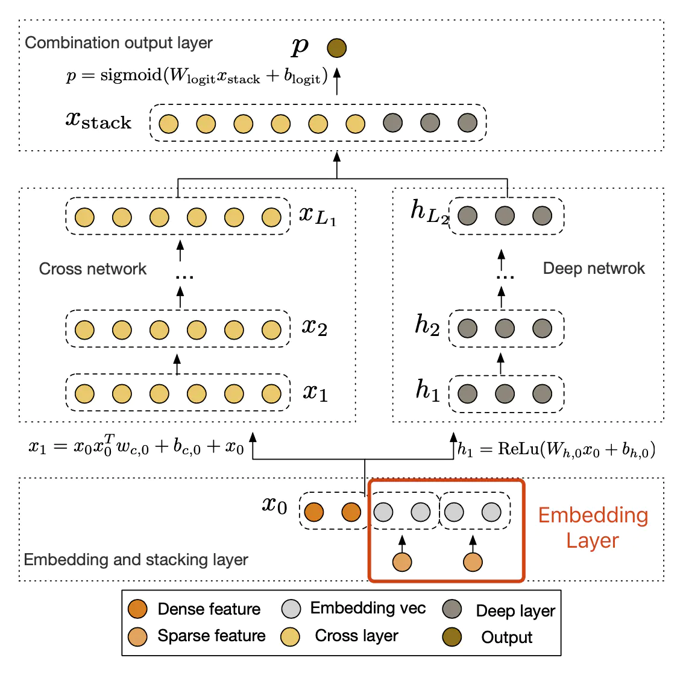
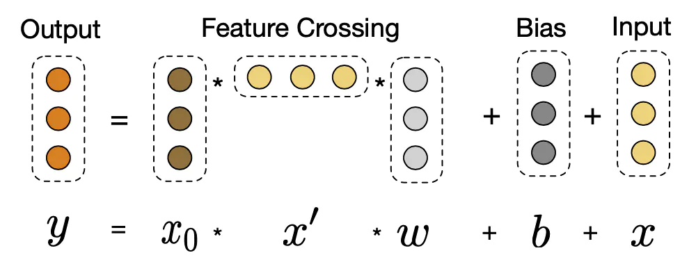

# 深度学习推荐算法之 Deep&Cross

原论文：《**Deep&Cross Network for Ad Click Predicitons**》

## 1. 论文背景

​		Deep&Cross 模型的提出的应用场景仍然是推系统和计算广告领域十分常见的点击率预估的问题。在此之前诞生了具有划时代意义的 Wide&Deep 模型，其中 Wide 侧来增强模型的记忆能力，而用Deep 侧来保证模型的泛化能力，但是这种Wide侧的设计却存在一定的缺点，因为Wide 侧需要人工进行特征组合和筛选，尤其是在大规模稀疏数据的时候，对特征的筛选和组合不仅对算法工程师的经验和对业务的理解提出了很高的要求，同时也需要花费大量的时间。而 Deep&Cross 模型的提出就是为了解决 Wide 侧存在的问题。作者提出用一个 Cross Network 替换掉 Wide 部分，来进行特征之间的自动交叉组合，并且网络的时间和空间复杂度都是线性的。通过与 Deep 部分结合，构成了深度交叉网络（Deep&Cross），简称 DCN。

## 2. 模型结构

​		DCN 模型的输入是稠密向量和稀疏向量，可以进行自动特征学习，有效捕捉有限度的特征交互，学习高度非线性的特征之间的交互，而不需要复杂繁琐的特征工程和详细的特征搜索，并且具有较低的计算成本，模型的整体结构如下图：

​		模型的结构比较简单，其中的 Embedding、Stacking 以及 Deep 层都是比较经典的层，没有什么特别之处，主要在于 Cross 层相对于前人的创新。

  - **Embedding 和 Stacking 层**

    ​	Embedding 层就是将大量经过 one-hot 编码的稀疏特征向量转化成稠密的向量表示，这已经是很常规的操作了；

    ​	Stacking 层就是将所有的 Embedding 向量以及稠密的特征进行拼接，这也是很常见的操作；

  - **Cross 网络**

    ​	Cross 层是 DCN 网络中最关键的部分，它以一种高效的方式来进行特征的交叉，Cross网络包含若干个 Cross 层，每一层都通过一下的计算方式进行计算：
    $$
    X_{l+1}=X_0X_{l}^TW_{l}+b_l+X_l=f(X_l,W_l,b_l)+X_l
    $$
    ​	其中的 $X_l$，$X_{l+1}$ 分别是第 $l$ 层和第 $l+1$ 层的 $Cross$ 列向量，$W_l$ 和 $b_l$ 是第 $l$ 层的权重和偏置项。每一层在进行特征交叉 $f$ 之后都会加上本层的输入 $X_l$ 。映射函数 $f:R^d->R^d$  代表着 $X_{l+1}-X_l$ ,也就是残差，下面是示意图：

    

    ​		这种结构设计的巧妙之处在一，一方面可以使得交叉特征的阶数随着 Cross 层的加深而逐渐增大，对于第 $l$ 层 layer，它的最高多项式阶是 $l+1$；另一方面，其可以在线性时间复杂度之内完成这些交叉。

    ​		总的来说，这种设计具有以下的特点：

    1. **有限高阶：**叉乘的阶数由网络的深度决定，深度 $L_c$ 对应的最高的 $L_{c}+1$ 阶的叉乘；
    2. **自动叉乘：**Cross输出包含了原始特征从一阶到 $L_c+1$ 阶的所有叉乘组合，而模型的参数量仅仅随着输入维度成线性增加；
    3. **参数共享：**不同叉乘对应的权重不同，但是并非每个叉乘对应的权重独立，通过参数共享，cross有效降低了参数量，此外，参数共享还使得模型具有更强的泛化性和鲁棒性。（比如当模型的不同交叉对应的参数独立学习的时候，没有出现过的参数组合的权重将会是0，而参数共享则不会。类似的，数据集中的一些噪声可以由大部分正常样本来纠正权重参数的学习）。

    

    ​	**计算复杂度分析：**

    ​		令 $L_c$ 为cross层的数量，$d$ 代表输入向量的维度，那么cross 层的参数是：
    $$
    d\times L_c\times 2
    $$
    ​		即cross层的时间复杂度和空间复杂度都是输入向量的线性函数，相比于 deep 层，cross 层引入的复杂度微不足道，这就保证了 DCN 的复杂度和 DNN是差不多的。

    ​		我们观察以下公式：
    $$
    X_{l+1}=X_0X_{l}^TW_{l}+b_l+X_l=f(X_l,W_l,b_l)+X_l
    $$
    ​		上面公式的计算最耗时的是前面的 $X_0X_l^TW_l$ 部分，如果先计算前半部分，得到的是一个矩阵，然后跟后面 $W_l$ 相乘再得到一个向量。但是我们仔细观察会发现，$X_l^TW_l$ 得到的会是一个标量，然后再和前面的向量计算的话，时间复杂度会低很多，所以为了计算的优化，我们会选择先计算 $X_l^TW_l$ 再计算 $X_0X^T_lW_l$，。

  - **Deep 层**

    ​		Deep 层就比较简单了，就是离散特征经过了 Eembedding 之后得到的向量和Dense feature拼接得到的向量依次通过全连接层，每一层的计算方式如下：
    $$
    h_{l+1}=f(W_lh_l+b_l)
    $$
    ​		其中 $h_l\in R^{n_l}$，$h_{l+1}\in R^{l+1}$ 代表的是第 $l$ 层和第 $l+1$ 个隐藏层，$W_l$ 和 $b_l$ 代表的是对应权重和偏置参数，$f(.)$ 代表的是 $ReLU$ 激活函数。

- **输出层**

  ​		输出层就是将 Cross 部分和 Deep 部分得到的向量经过拼接之后经过一个逻辑回归层，其计算公式如下：
  $$
  p=sigmoid([X_{L1}^T,h_{L_2}^T]W_{logits})
  $$
  ​		其中的 X，h分别表示 Cross 层和  Deep 层得到输出。损失函数是一个标准的交叉熵损失函数加上一个正则项：
  $$
  loss=-\frac{1}{N}\sum_{i=1}^N[y_ilog(p_i)+(1-y_i)log(1-p_i)]+\lambda\sum_l||W_l||^2
  $$
  ​		

## 3. 模型总结

​		DCN 模型的主要贡献有几下几个方面：

- 提出一种新型交叉网络结构，可以用来提取交叉组合特征，并不需要人为设计的特征工程；

- 这种网络结构足够简单，但是同时又很有效，可以获取随网络层数增加而增多的多项式阶交叉特征；

- 十分节约内存（依赖于正确的实现），并且易于使用

- 实验效果表明，DCN相比于其他模型有更出色效果，较少的参数量；

  