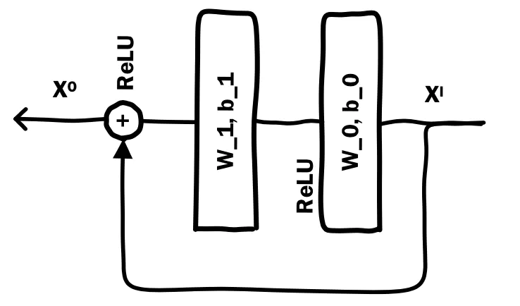

## 深度学习推荐算法之 Deep Crossing

原论文《**Deep Crossing： Web-Scale Modeling without Manually Crafted Combinatorial Features**》

### 1. 论文背景

​	    传统机器学习算法充分利用所有的输入特征来对新实例进行预测和分类。但是，仅仅使用原始特征很难获得最佳结果。因此无论是在工业界还是学术界，都进行着大量的工作来对原始特征进行转换。一种有效的特征转换方式是进行多种特征的组合，然后将融合后的特征输入到学习器中去。
 	   组合特征在很多领域已经被证实能发挥强大的功能。然而，进行高效的特征融合却需要高昂的成本代价。随着特征数量的增加，管理，维护变得充满挑战，尤其是在大规模的网络应用程序中。庞大的搜索空间和样本数量，导致训练和评估变得异常缓慢，因此寻找额外的组合特征来改进现有模型是一项艰巨的任务。
 	   深度学习模型天然就可以从独立特征中进行学习，并且无需人工干预。在计算机视觉以及自然语言处理等领域已经发挥出了它强大的功能，比如基于CNN的模型在图像识别比赛中取得的成绩就已经超过了基于传统手工特征SIFT的相关方法取得的最好成绩。
​        Deep Crossing模型将深度学习从图像和自然语言处理等领域扩展到了更加广泛的环境中，比如每个输入特征都具有不同的性质。更具体地说，它可以输入诸如文本、类别、ID以及数值信息等特征，并且根据特定任务要求，自动搜索最佳的特征组合。

### 2. 模型介绍

#### 2.1 模型架构

首先给出Deep Crossing的整体模型架构图，如下：

​		为了完成端到端的训练，Deep Crossing 模型要在内部解决以下问题：

   1. 离散特征编码后过于稀疏，不利于直接输入到神经网络中进行训练，如何解决特征向量稠密化的问题；

   2. 如果进行特征的自动交叉组合；

   3. 如何在输出层中达成问题设定的优化目标；

      Deep Crossing 模型分别设置了不同的神经网络层来解决上面的问题。其网络结构主要包括四层：

- **Embedding **层：该层的主要作用是将稀疏的类别特征转换成稠密的 Embedding 向量。每一个稀疏的特征经过 one-hot 编码之后通过 Embedding 层，会换成对应的 Embedding 向量。此处的 Embedding 是以经典的全连接形式进行。

- **Stacking ** 层：该层的作用比较简答，就是将不同的 Embedding 特征和数值型特征拼接到到一起，形成新的包含全部特征的特征向量。

  残差单元如下：

  

- **Multiple Residual Units** 层：该层主要结构是多层感知机，其采用的是多层残差网络。

- **Scoring** 层：作为输出层，其目的就是为了拟合优化目标而存在的；对于 CTR 预估这类二分类问题，一般都是 Logistic 回归模型。

​	

#### 2.2 损失函数

​		因为论文中的应用场景是 CTR 预估，这是一个二分类的问题，所以使用的是交叉熵损失函数：
$$
loss =-\frac{1}{N}\sum_{i=1}^N(y_ilog(p_i)+(1-y_i)log(1-p_i))
$$

### 3. 模型总结

​		Deep Crossing 是第一篇论文完整描述深度学习推荐系统的技术细节，其完整解决了从特征工程、稀疏向量稠密化、多层神经网络进行优化目标拟合等一系列深度学习在推荐系统中的应用问题，为后续的研究打下了基础。