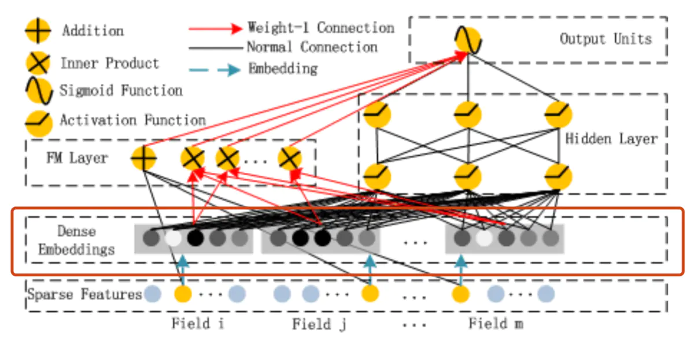

# 深度学习推荐系统之DeepFM

原论文：**《DeepFM：A Factorization-Machine based Neural Network for CTR Prediction》**

## 1. 论文背景

​		对于 CTR 问题，被证明的最有效的方法是特征的交叉组合，在 CTR问题研究的历史来看，就是如何更好地学习特诊的交叉组合，进而更加精确地描述数据的特点。可是说这是基础推荐模型模型到深度学习推荐模型遵循的一个主要思想。而组合特征大牛们研究过二阶、三阶、甚至更高阶的特征组合，但是面临的问题就是随着阶数的提升，复杂度成几何倍的增加。这样即使模型表现好了，但是在推荐系统的实时性要求上也不能满足要求。所以很多模型的出现都是为了解决另外一个更加深入的问题：如何高效地学习特征的交叉组合？

​		为了解决这个问题，出现了 FM 和 FFM 模型来优化 LR 模型在特征组合方面表现价较差的问题。并且这个时候，科学家们已经发现 DNN 在特征组合方面的优势，所以出现了 FNN 和 PNN等深度网络的模型。但是 DNN 也存在一定的局限性。

- **DNN 的局限性**：

  ​		当我们使用 DNN 网络来解决推荐问题时，存在的最大的问题就是网络参数过于庞大，这是因为在进行特征处理的的时候，需要我们使用 one-hot 变量来编码离散的特征，这会导致输入的维度猛增，下面一张图就可以表达这个问题：

  

  ​		这样庞大的参数是不实际的，为了解决 DNN 参数数量过于庞大的问题，可以采用非常经典的 Field 思想，将 one-hot 特征转换为 Dense Vector

  

  ​		这时通过增加全连接层就可以实现高阶特征组合，如下图所示：

  

  ​		但是仍然缺少低阶的特征组合，于是增加 FM 来表示低阶的特征组合。

- **FNN 和 PNN：**

  ​		结合 FM 和 DNN 模型的方式有两种，可以串行、也可以并行，这两种方式各有几种代表模型。在 DeepFM 之前有 FNN，虽然在影响力上可能并比不上 DeepFM，但是了解 FNN 的对于帮助我们理解 DeepFM 的特点和优点是很有帮助的。

  

  ​		FNN 使用预训练好的 FM 模块，得到隐向量，然后把隐向量作为 DNN 的输入，但是经过试验进一步发现，在 Embedding layer 和 hidden layer1 之间增加了一个 product 层，可以更好地提高模型的表现，于是出现了 PNN 模型，使用 product layer 替换 FM 预训练层。

- Wide & Deep

  ​		FNN 和 PNN 还有一个比较明显的缺点，就是对于低阶组合特征学习到的比较少，这一点主要是因为 FM 和 DNN 之间的串行方式导致的，也就是说虽然 FM 学到了低阶的特征组合，但是 DNN 全连接的结构导致 低阶特征并不能在 DNN 的输出端较好地表现。于是出现了将串行改为并行的方式能比较好地解决这个问题，于是 google 提出了 Wide&Deep 模型，但是如果深入探究 Wide & Deep 的构成方式，虽然将整个模型的结构调整成 并行的方式，在实际使用中，Wide 部仍然需要比较精巧的人工特征工程，换句话说就是人工处理对于模型的效果有比较大的影响（这一点可以在 Wide&Deep模型部分得到验证）

  

  ​	    该模型还有一个问题就是：在 output Units 阶段直接将低阶特征和高阶特征进行组合，很容易让模型最终偏向于学习到低阶或者高阶的特征，而不能做到很好的结合。于是就有了 Deep&Cross 和 DeepFM 模型的提出。

## 2. 模型的结构和原理

​		为了能够同时进行低阶特征和高阶特征的组合，并且以端到端的方式进行训练，论文作者提出了 DeepFM 模型，模型的结构如下所示：

​		DeepFM  其实延续了 Wide&Deep 双模型组合的架构，它使用 FM 去替代 Wide&Deep 模型中的 Wide 部分，加强了浅层网络特征组合的能力。上图中，左侧的 FM 部分与右侧的 Deep 神经网络部分共享 Embedding 层的权重。左侧 FM 部分对不同特征域的 Eembedding 进行了两两交叉，也就是将 Embedding 向量当做原 FM 中的特征隐向量。最后将 FM 的输出与 Deep 部分的输出一同输入到最后的输出层，参与最后的目标拟合。

​		与 Wide&Deep 模型相比，DeepFM 模型的改进主要针对 Wide&Deep 模型中 Wide 部分进行改进，因为 Wide 部分不具备特征的自动交叉组合能力。这里改动的动机和 Deep&Cross 的动机是一样的，唯一不同在于，Deep&Cross 网络中使用的是多层 Cross 网络进行特征的交叉组合，但是 DeepFM 中使用的是 FM 进行特征的组合。

**FM 模块：**

​		下面是 FM 单独的一个结构图，从图中大致可以看出，FM_layer 是由一阶特征和二阶特征交叉之和再经过一个 sigmoid 函数得到的。所以在实现的时候需要单独考虑 linear 部分和 FM 部分的交叉部分：
$$
\hat y_{FM}(x)=w_0+\sum_{i=1}^Nw_ix_i+\sum_{i=1}^N\sum_{j=i+1}^Nv_i^Tv_jx_ix_j
$$

​		在实现的时候，一阶部分实际上是连续的数值型特征和 one-hot 编码的类别型特征拼接到一起之后经过一个 Dense 层，这和经典的 FM 模型是一致的 （在实际的应用业务中，可以根据业务的不同进行不同的考量，这里的 Dense 特征并不是必须的，有可能在实际应用中，会将数值特征进行分桶，然后当做类别型特特征进行处理）；但是二阶的部分实现的时候，主要是针对离散特征，也就是首先将离散特征经过 Embedding 层之后，然后使用 FM 进行特征交叉。

**Deep模块：**

​		Deep 模块架构图如下所示：

​		Deep 部分是为了学习高阶的特征组合，在上图中使用全连接的方式将 Dense Embedding 输入到 Hidden Layer，这里面 Dense Embedding 就是为了解决 DNN 中的参数爆炸问题，这也是就推荐模型中常用的处理方法。

​		Embedding 层的输出是将所有的 id 类特征对应的 Eembedding concat 到一起之后输入到 DNN 中。其中 $v_i$ 表示第 i 个field 的 embedding ，m是 field 的数量。
$$
z=[v_1,v_2,...,v_m]
$$
​		上一层的输出作为下一层的输入，我们可以得到：
$$
z_L=\sigma(W_{L-1}Z_{L-1}+b_{L-1})
$$
​		其中$\sigma$ 表示激活函数，$z、W、b$ 分别表示该层的输入、权重和偏置。

​		最后进入 DNN 部分输出使用 sigmoid 激活函数进行激活：
$$
y_{DNN}=\sigma(W^La^L+b^L)
$$
​		这一部分基本上就是常规的 Deep 部分的操作了，就是将离散特征的 Embedding 向量和 Dense 特征拼接到一起之后，输出 DNN 网络。

### 总体结构：

### 模型对比：

