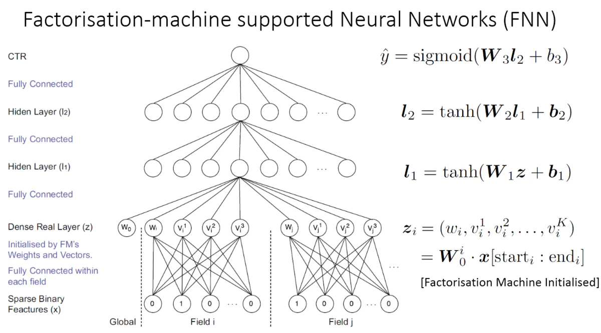
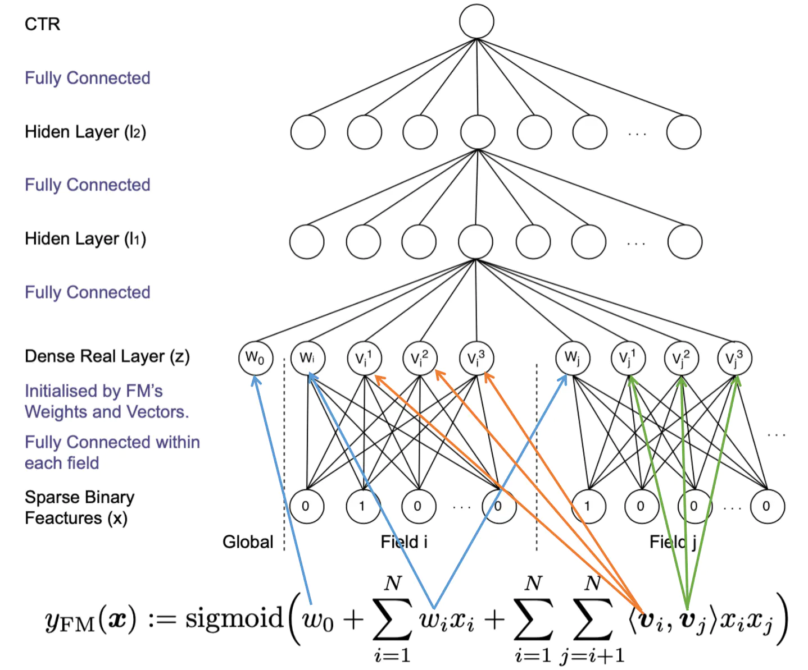

# 深度学习推荐算法之FNN

原论文**《Deep Learning Over Multi-field Categorical Data》**

## 1. 论文背景

​		在文章开始，作者就用很大的篇幅介绍了模型提出的动机和要解决的问题。

​		在模型提出之前，大部分的 CTR 模型都是线性模型，比如逻辑回归、朴素贝叶斯、FTRL逻辑回归和贝叶斯逻辑回归等模型。所有的这些模型都是基于 one-hot 稀疏编码。线性模型简单、有效，但是性能比较差，因为无法学习到特征之间的交叉关系。非线性模型可以通过特征之间的组合提高模型的能力。比如之前已经提出的 FM，将二值化的特征映射成连续的低维空间，通过內积获取特征间的相互关系。GBDT 在建树的过程中，自动地学习特征的组合。但是，这些方法并不能利用所有可能的特征组合（特征交叉能力有限）。而且很多模型依然需要手工进行特征工程，来决定如何进行特征的组合。另一个问题是，已有的 CTR 模型在对复杂数据间的潜在模式上的表达能力非常有限。所以，它们的泛化能力是非常有限的。

​		深度学习在 CV、NLP 中的成功，表明了神经网络具有学习数据高维特征表示的能力。在 CTR 中，大部分的输入特征是来自各个领域的，而且是离散的类别特征。比如用户所在的城市信息（London，Paris，Beijing），设备类型（PC，Mobile），广告类别（Sports， Electronics）等等，而且各个特征之间的相互依赖是未知的。因此，我们抱着极大地兴趣想了解一下，深度学习方法是如何在大规模的多特征域的离散类别数据上通过学习特征表示来提高CTR任务的估计准确度的。

## 2. 模型介绍

​		FNN 的整体模型架构如下图所示：

​		根据图中信息粗看，其与 Deep Crossing 模型有几分相似，下面对模型的每一层做一个介绍；

- **输出层**：

  因为模型的适用场景是点击率预估，所以最后的激活函数使用的是 sigmoid 函数；
  $$
  \hat y=sigmoid(W_3l_2\ +\ b_3)
  $$
  其中的 $W_3$，$b_3$ 是对应的权重和偏置项；

- **$l_2$ 层**

  该层是一个简单的全连接层，使用的激活函数是 $tanh(x)$
  $$
  l_2 = tanh(W_2l_1 + b_2)
  $$
  作者也尝试了其他的激活函数，但是最后证明 $tanh$ 是最好的；

- **$l_1$ 层**

  该层是一个简单的全连接层，使用的激活函数是 $tanh(x)$
  $$
  l_1 = tanh(W_2z + b_1)
  $$

- **$Dense Real $ 层**

  该层是 Embdding 向量拼接之后形成的，但是这个 Embedding 向量的拼接和之 Deep Crossing 的拼接方式是不一样的。其中 z 的定义如下：
  $$
  z=(w_0,z_1,z_2,...,z_i,...,z_n)
  $$
  $w_0$ 是全局的偏置标量，$n$ 是征域的总数，$z_i\in R^{K+1}$ 是第 $i$ 个特征域对应的 Embedding，其结构和内容如下所示：
  $$
  z_i = W^i_0.x[start_i:end_i]=(w_i,v^1_i,v^2_i,...,v^K_i)
  $$
   其中 $start_i$ 和 $end_i$ 是第 $i$ 个特征域的起止下标，其中的 $w_i,v^1_i,v^2_i,...,v^K_i$ 都是通过因子分解机的参数进行初始化的，因子分解机的表达式如下：
  $$
  y_{FM(x)}=sigmoid(w_0+\sum_{i=1}^Nw_ix_i+\sum_{i=1}^N\sum_{j=i+1}^N<v_i,v_j>x_ix_j)
  $$
  每一个特征域中的每一个特征都会对应一个偏置项和一个 $K$ 维的隐向量 $v_i$，特征交互是将它们的隐向量进行內积操作得到的，下面的一张图更能清晰地表达因子分解机和 FNN 的关系。

  

  ​		需要注意的是，虽然上图中 FM 的参数直接指向了 FNN 中的 Embedding 层的各个神经元，但是其具体的意义是初始化 Embedding 神经元与输入神经元之间的去权重。需要说明的是，在训练 FM 的过程中，并没有对特征域进行区分，但是在 FNN 中，特征被分成了不同特征域，因此在每个特征域具有对应的 Embedding 层，并且每个特征域 Embedding 的维度都应该与 FM 隐向量的维度保持一致。

  ​		使用预训练的FM来初始化 FM 模型的第一层的参数，可以有效地学习特征表示，相当于引入了先验的信息，并且绕开了高维二值输入带来的计算复杂度高的问题。

## 3. 模型的特点与启发

- **FNN 模型的特点：**

  - 采用 FM 预训练得到的隐藏层及其权重作为神经网络的第一层的初始值，之后再不断堆叠全连接层，最终输出预测的点击率；

  - 可以将 FNN 理解成一种特殊的 Embedding+MLP，其要求第一层嵌入后的特征域特征维度一致，并且嵌入权重的初始化是 FM 预训练的；

  - 不是一个端到端的训练过程，有贪心训练的思路，如果不考虑预训练的过程，模型网络结构也没有考虑低阶特征组合；

- **FNN 模型的优缺点：**

  - 优点：引入 DNN 对特征进行更高阶的组合，减少特征工程，能在一定程度上增强 FM 的学习能力，这种尝试为后来深度推荐模型的发展提供了新的思路。
  - 缺点：
    1. 两阶段训练模式，在应用过程中不方便，而且模型能力受限于 FM 表征能力的上限；
    2. FNN 专注于高阶组合特征，但是却没有对低阶特征进行建模。

## 4. 思考题

**为什么 Embedding 层的收敛速度往往很慢？**

​		在深度学习中，Embedding的作用是将高维稀疏的输入向量转化为稠密的低维向量，并且希望能尽可能多地保留信息甚至学习到具有特征意义的标识，但是 Embedding 层的训练往往是很费时的，主要有以下两个方面的原因：

​		1. Embedding 层的参数量十分巨大，甚至有可能 Embedding 层的参数占了整个网络权重的绝大部分，所以训练过程的开销可能 Embedding 层占了大部分。

​		2. 由于输入的是稀疏向量，导致在随机梯度下降的过程中，只有非零特征相连的 Eembedding 层权重会更新，这进一步降低了 Embedding 层收敛的速度。

