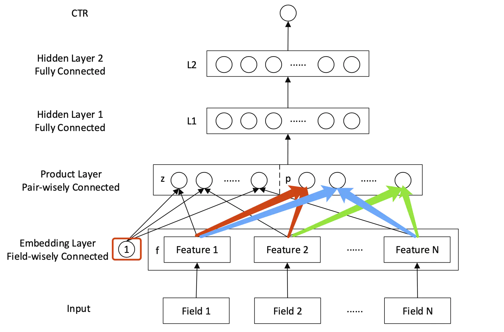

## 深度学习推荐算法之 PNN

原论文：《**Product-based Neural Network for User Response Prediction**》

### 1. 论文背景

​		PNN 的提出仍然是为了解决 CTR 预估和推荐系统问题，在此之前，Neural CF 利用多层神经网络代替经典协同过滤的点积操作，加强了模型的表达能力。但是广义上来说，任何向量之间的交互计算方式都可以用来替代协同过滤的内积操作，相应的模型可称为广义的矩阵分解模型。但是Neural CF 模型只提到了用户向量和物品向量两组特征向量，并没有加入更多的特征。而 Deep Crossing 模型虽然加入了更多的特征信息，但是其在 Embedding 层之后只用一个 Stacking 层（也就是简单的堆叠操作），这可能无法充分地获得特征之间的交叉信息。

​		PNN 是由上海交通大学的研究人员提出的模型，该模型包含一个embedding层来学习类别数据的分布式表示，此外还包含product层来捕获字段之间的特征交互模式，最后包含一个全连接层去挖掘更高阶的特征交互。相比Deep Crossing模型，PNN模型在输入、EMbedding层、多层神经网络、以及最终的输出层并没有什么结构上的不同，唯一的区别在于PNN引入了Product（乘积）层来代替了Deep Crossing中的Stack层，即不同特征的embedding向量不再是简单地拼接在一起，而是使用Product操作来进行两两交互，更有针对性地获取特征之间的交叉信息。

### 2. 模型架构

​		模型的整体架构图如下所示：

​		模型自顶向下的计算过程如下：

- **输出层**

  ​		因为数二分类问题，所以输出的值 $\hat y\in(0,1)$，代表点击率，计算方式如下：
  $$
  \hat y=sigmoid(W_3l_2+b_3)
  $$
  ​		其中，$W_3\in R^{1\times D_2}$，$b_3\in R$ 是模型的输出层参数，$l_2\in R^{D_2}$ 是第二个隐藏层的输出，$D_i$ 是代表第 $i$ 个隐藏层的维度。

- **L2隐藏层**

  ​		第二个隐藏层的输出 $l_2$ 的计算公式为：
  $$
  l_2=relu(W_2l_1+b_2)
  $$
  ​		其中，$W_2\in R^{D_2\times D_1}$，$b_2\in R^{D_2}$ 是模型的输出层参数，$l_1\in R^{D_1}$ 是第一个隐藏层的输出，$D_i$ 是代表第 $i$ 个隐藏层的维度。

- **L1隐藏层**

  ​		第一个隐藏层的输出由以下计算公式得到：
  $$
  l_1=relu(l_z+l_p+b_1)
  $$
  ​		其中，$l_z$ 是对特征向量的线性操作得到的输出，$l_p$ 是对特征向量进行 product 操作的到的输出，$b_1\in R^{D_1}$ 是偏置项。（在实际应用中，类别或者离散特征会经过 Embedding 层以及Product 层最终得到 $l_z$ 和 $l_p$ 然后再进行上面的运算过程，但是连续的数值型特征会直接拼接在 $l_1$ 之后。

- **Product层**

  ​		product 层主要就是 Embedding 之后的离散型特征向量进行进一步的交叉。这一部分是 PNN 模型的关键部分，正是因为有这一步的交叉，才使得 PNN 模型拥有超过之前的 Deep crossing 以及 FNN 模型的特征交叉能力（交叉交叉，当然是强调特征之间的交互），我们前面已经知道，最终 product 层会输出对特征向量线性操作得到的 $l_z$ 和非线性 product 操作得到的 $l_p$。

  ​		我们先定义向量之间的內积操作：
  $$
  A^\bigodot B=\sum_{i,j}A_{i,j}B_{i,j}
  $$
  ​		也就是对 A，B逐个元素相乘之后再相加形成一个标量。

  - 线性部分

    对于 $l_z$ ，文中的计算过程如下：
    $$
    l_z=(l^1_z,l^2_z,...,l^n_z,...,l^{D_1}_z),\ \ \ \ l^n_z=W^{n\bigodot}_z z
    $$
    ​		其中，$z=(z_1,z_2,...,z_N)=(f_1,f_2,...,f_N)$，$N$ 为 field 数目, $f_i\in R^M$ 为第 $i$ 个特征的嵌入向量，$W_z$ 一共有$D_1$ 个，每一个维度为 $R^{M\times N}$。

    ​		所以一共会有 $D_1$ 个维度为 $M\times N$ 的矩阵作为线性部分的参数，在工程实践的时候，可以将各个特征域的 Embedding 向量组成的 Embedding 矩阵先做 Flatten 操作然后再直接与一个维度为 $R^{(MN)\times D_1} $ 的矩阵乘积即可得到整个 $l_z$

    ​		也就是说，$z$ 的计算就是通过对 Embedding 向量组成的矩阵进行简单的线性变换得到。

    ​       

  - 非线性部分

     对于 $ l_p$ ，文中给出的计算方式如下，不同于 $l_z$ 直接对原始特征的 $Embedding$ 矩阵做线性变换，其对经过 product 操作之后的矩阵 $p$ 进行矩阵点积，因为一共有 $N$ 个特征域，两两之间需要做 product 操作，所以最终 $p$ 的维度为 $N\times  N$
    $$
    l_p=(l_p^1,l_p^2,...,l_p^n,...,l_p^{D1}),\ \ \ \ l^n_p=W^{n\bigodot}_p p
    $$

    $$
    p=\{p_{ij}\},i=1,...,N;\ j=1,...,N
    $$

    

  ​				而对于 $p$ 的计算，文中给出了两种不同的计算方式。分别是基于內积的 IPNN 和基于外积的 OPNN

  

  ​       **IPNN**：

  ​	    也就是內积操作，就是说每一个特征域的 Embedding 之间的交互方式为內积的交互方式，即：
  $$
  p_{i,j}=g(f_i,f_j)=<f_i, f_j>
  $$
  

  ​		在 IPNN 中，$p\in R^{N\times N}$，$p_{i,j}=<f_i,f_j>$，$W_p$ 一共有 $D_1$ 个，每个维度为 $N\times N$ 。因为 $W^n_p$ 是对称矩阵，为了简化运算，可以将每一个 $W^n_p$ 看成是一个列向量与其转置行向量的乘积，即 $W^n_p=\theta_n \theta_n^T$，于是可以简化运算。
  $$
  \begin{align}
  
  l_p^n &= W_p^n \odot{p} \\
  	  &= \sum_{i=1}^N \sum_{j=1}^N (W_p^n)_{i,j}p_{i,j} \\
  	  &= \sum_{i=1}^N \sum_{j=1}^N \theta^n \theta^n  \\
  	  &= \sum_{i=1}^N \sum_{j=1}^N   <\theta^n f_i, \theta^n f_j> \\
  	  &= <\sum_{i=1}^N \theta^n f_i, \sum_{j=1}^N \theta^n f_j> \\
  	  &= ||\sum_{i=1}^N \theta^n f_i||^2
  \end{align}
  $$
  

  ​		在工程实践中，每一个 $\theta_n(f_1,f_2,...,f_N)$ 通过广播机制，再对 N 个field对应维度求和，得到 M 维向量 $\sigma_n$，则 $\sigma_n^T\sigma_n$ 即为 $l^n_p$。

  

  ​		**OPNN:**

  ​		也就是外积操作，也即是说，每一个 $p_{i,j}$ 是通过外积计算得到的，也就是说：
  $$
  p_{i,j}=g(i,j)=f_if_j^T
  $$
  ​		从外积操作的公式上，可以看到，两个向量执行外积之后，得到的是一个矩阵 $M\times M$。所以根据通用的公式，$W_p^n$ 中的每一个元素也应该是一个矩阵，那么根据这个思路，每一个 $l_p^n$ 的计算过程为外积矩阵乘以权重矩阵中对应位置的子矩阵然后将整个相乘得到的大矩阵对应位置的元素相加，用公式表示就是：

  
  $$
  \begin{align}
  
  l_p^n &= W_p^n \odot{p} \\
  	  &= \sum_{i=1}^N \sum_{j=1}^N (W_p^n)_{i,j}p_{i,j} \\
  	  &= \sum_{i=1}^N \sum_{j=1}^N (W_p^n)_{i,j} f_i f_j^T
  
  \end{align}
  $$
  ​		其中，$(W_p^n)_{i,j}$ 表示的也应该是一个矩阵，而不再是一个值，此时的计算复杂度是：$O(D_1\times N^2\times M^2)$，这个时间复杂度肯定是不能接受的，$p$ 的计算方式变成了：
  $$
  p=\sum_{i=1}^N\sum_{j=1}^Nf_if_j^T=f_{\sum}(f_{\sum})^T
  $$
  ​		

  ​		其中 $f_\sum=\sum_{i=1}^Nf_i$

  ​		$W^n_p\in R^{M\times M}$，一共 $D_1$ 个。 

  ​		虽然叠加概念的引入可以降低计算开销，但是中间的精度损失也是很大的，这应该是性能和精度之间的 trade-off。

- **Embedding层**

  该层没有什么特别之处，就是和 DeepCrossing 模型一样的 Embedding 层计算。

  

### 3. 模型总结

​		PNN 的结构特点在于强调了特征 Embedding 向量之间的交互方式是多样化的，相比于简单地交由全连接层进行无差别化的处理，PNN模型定义的內积和外积操作显然更具有针对性地强调了不同特征之间的交互，从而让模型更容易捕获特征的交互信息。

​		但是 PNN 模型同样存在一些局限性，例如外积操作的实际应用中，为了优化训练效率进行了大量的简化操作，除此之外对所有特征进行无差别的交叉，在一定程度上忽略了原始特征向量中包含的有价值信息。如何综合原始特征和交叉特征，让特征的交互方式更加高效，后续的 Wide&Deep 模型以及基于FM的各类深度学习模型将给出它们的解决方案。

### 4. 思考题

- 为什么 MLP 有对特征进行高阶交叉的作用？

  ​		虽然感知机是一个基于加法的操作，两个特征从来没有直接交叉过；即使到了下一层，不同特征之间，也不会直接相乘，而是继续以加权求和的方式叠加起来。但是，因为有激活函数的存在，当经过 sigmoid、tanh这类激活函数之后，与其他神经元的进一步混合，再通过下一层神经元的激活函数增加非线性，经过层层神经网络处理后，会使得 MLP 具备特征交叉的能力，甚至在层数非常多之后，具备拟合任意函数的能力。

  ​		但是 MLP 这种特征交叉的能力是比较弱的，MLP 并不是天生为特征交叉设计的，所以这也是为什么很多深度学习神经网络加入 Product 层来做特征交叉。

  ​		下面回顾一下，哪些经典的模型分别应用了什么样的 product 层来做特征交叉：

  ​		Wide&Deep 模型种，Wide部分其实就是两个特征的乘积层；

  ​		DeepFM中，用 FM Layer 进行特征交叉，用 MLP 作为 DeepFM 的Deep部分；

  ​		PNN 中则是直接加入了 Product 层，加强了模型的交叉能力；

  ​		还有专门真针对特征交叉层进行改造的模型也有很多，诸如 Deep Crossing、Deep & Cross等，这些网络有的直接通过乘积擦操作将两个特征相乘，有的通过 FM 这类善于处理特征交叉的模型作为交叉层，有的通过构造一些特征 Cross 的方法进行特征组合。这些所有的做法都充分说明一点，仅仅采用 MLP 进行特征交叉足额和的能力是不够的，需要有针对性地在模型中加入特征交叉的结构。

  

