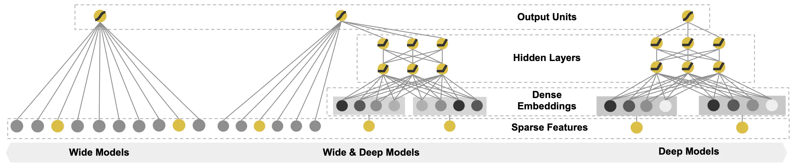

# 深度学习推荐算法之 Wide&Deep

原论文：**《Wide & Deep Learning for Recommender Systems》**

## 1. 论文背景

​		**先介绍 ”记忆能力“ 与 ”泛化能力“**

​		“记忆能力” 可以理解为模型直接学习并利用历史数据中物品或特征的 ”共现频率“ 的能力。一般来说，协同过滤、逻辑回归等简单模型具有较强的 “记忆能力”。因为模型简单，原始数据往往可以直接影响推荐结果，产生类似于 “如果点击过 A，就推荐 B” 这类规则似的推荐，这就相当于模型直接记住了历史数据的分布特点，并利用这些记忆进行推荐。通常简单的模型具有较强的记忆能力，比如像逻辑回归这类简单的模型，如果发现 “强特征”，那么其相应的权重会在模型训练过程中被调整得非常大，这样就实现了对这个特征的直接记忆。相反，对于多层神经网络来说，特征被多层处理，不断与其他特征进行交叉，因此模型对这个强特征的记忆反而没有那么深刻。

​		“泛化能力” 可以理解为模型传递特征的能力，以及发掘稀疏甚至从未出现过的稀有特征与最终标签相关性的能力。比如矩阵比协同过滤的泛化能力强，因为矩阵分解引入了隐向量这样的结构，使得稀少的用户或者物品也能生成隐向量，从而获得有数据支撑的推荐得分。这就是典型地将全局数据传递到稀疏物品上，从而提高泛化能力。再比如，深度神经网路，通过特征的多次自动组合，也可以深度发掘数据中潜在的模式，即使是非常稀疏的特征向量输入，也可以得到较平稳的推荐概率。

​		**Wide&Deep 提出的背景**

​		 在 CTR 预估任务中，利用手工构造的交叉特征组合来使模型具有 ”记忆性“ ，使模型记住共现频率较高的特征组合，往往也能达到不错的 baseline，而且可解释性很强，但是这种方式具有十分明显的缺点：

  1. 特征工程需要消耗大量的人力物力

  2. 模型是强行记住这些组合特征的，对于未曾出过的特征组合，权重系数为 0 ，无法进行泛化；

       前面已经介绍，简单模型具有很强的记忆能力，而泛化能力相对较弱，而复杂的神经网络（一般常用的 DNN 结构）具有较强的泛化能力，通过将稀疏特征编码为低维的稠密 Embedding ，这种基于 Embedding 的方式能够有效地提高模型的泛化能力，但是，基于 Embedding 的方式可能由于数据长尾分布，导致长尾的一些特征值无法被充分学习，其对应的 Embedding vector 是不准确的，这变化造成模型泛化过度，记忆能力减弱，而 Wide&Deep 模型的思路也很简单，就是将两个部分结合起来，并且联合训练，希望模型能够同时具有不错的记忆能力和不错的泛化能力。
       
       

## 2. 模型结构与原理

​		模型的结构比较简单，如下图所示，左边是 wide 部分的拆解图，右边是 Deep 模型的拆解图，中间就是 Wide&Deep 的模型示意图：

- **Wide 部分**

  ​	wide 部分就是一个广义的线性模型，其公式定义如下：
  $$
  y=w^T[x,\phi(x)]+b
  $$
  

  输入特征主要由两个部分构成，一部分是原始的特征部分，另一部分是原始特征经过交叉之后得到的特征，关于特征交叉的定义，可以定义为：
  $$
  \phi_k(x)=\prod_{i=1}^d x_i^{c_{ki}}, c_{ki}\in \{0,1\}
  $$
  ​	$c_{ki}$ 是一个布尔变量，当第 $i$ 个特征组合时，$c_{ki}$ 的值为1，否则为 0，$x_i$ 是第 $i$ 个特征的值，大体意思是两个特征都同时为 1 这个新的特征才能为 1，否则为 0。说白了就是一个特征组合。

  ​	对于 Wide 部分的训练，使用的是带 $L_2$ 正则化的 FTRL 算法，而 $L_1$ FTRL 是非常注重模型稀疏性质的，也就是说 $W\&D$ 模型采用这种优化方法的想法是让 Wide 部分变得更加稀疏，即 $Wide$ 部分的大部分参数都为 0，这就大大压缩了模型权重以及其特征向量的维度。Wide 部分训练完之后，留下来的部分都是非常重要的，那么模型的 “记忆能力” 就会变得很强。

  

-   **Deep 部分**

  ​	Deep 部分模型其实就是一个前馈神经网络，网络会对一些稀疏特征（比如ID）学习一个低维度的向量表示 Embedding ，维度通常在 $O(10)-O(100)$ 之间，然后与一些原始的稠密特征作为网络的输入，依次通过若干隐藏层进行前向传播，每一个隐藏层都指向以下计算：
  $$
  a^{(l+1)}=f(W^{(l)}a^{(l)}+b^{(l)})
  $$
  ​		其中 $f$ 是激活函数，这里选择的是 $Relu$。

  

- **Wide&Deep 联合训练**

  ​	论文特意强调了 $Wide$ 部分和 $Deep$ 部分是联合（Joint）训练的，而不是集成（Ensemble），集成训练时每个模型单独训练，再将模型结果进行汇总。因此每个模型都会学的足够好的时候，才会进行汇总，故而每个模型相对较大。而对于 $Wide\&Deep$ 模型，Wide 部分只是为了补偿 Deep 部分缺失的记忆能力，它只需要一小部分的叉乘特征，故而相对较小。Wide&Deep 模型采用的Logistic Loss 函数，模型的预测值定义如下：
  $$
  P(Y=1|x)=\sigma(w^T_{wide}[x,\phi(x)]+w^T_{deep}a^{(l_f)}+b)
  $$
  ​		

  ​		但是在模型训练的时候，两个部分使用是不同的优化算法，其中 $Wide$ 部分的数据是高维稀疏的，所以作者使用了 FTRL 算法优化，而 Deep 部分使用的是 Adagrad。
  
  

## 3. 总结

​		Wide&Deep 模型自提出以来，就在业界发挥着巨大的影响力。Wide 部分使得模型具有较强的 “记忆能力”，而 Deep 部分的主要作用是让模型具有 “泛化能力”，正是因为这样的特点，使得模型兼具了逻辑回归与深度神经网络的优点——能快速处理并记忆大量历史行为特征，并且具有强大的表达能力。不仅在当时迅速成为业界的主流，而且衍生出的大量以 Wide&Deep 模型为基础的混合模型，影响力一直持续至今。

​		Wide&Deep 模型将浅层模型和深层模型进行联合训练，综合利用千层模型的记忆能力和深层模型的泛化能力，实现单模型对推荐系统准确性和多样性的兼顾。Wide&Deep 模型的思想是模仿人有不断记忆并且泛化的过程，将线性模型用于记忆，而将深度神经网络模型用于泛化，汲取各自的优势，达到整体的效果最优。

​		Wide&Deeo 模型的成功点在于：

  1. 抓住了业务问题的本质特点，（记忆性和泛化性），能够融合传统模型的记忆能力和深度学习模型的泛化能力；

  2. 模型的结构并不复杂，比较容易在工程上实现、训练和上线，这也加速了其在业界的推广和应用。

     

## 4. 思考题

- 在你的应用场景中，哪些特征适合放在 Wide 侧，哪些特征适合放在 Deep 侧，为什么？

  ​		哪些特征需要放在 Wide 侧，哪些部分需要放在 Deep 侧，应该需要从这两侧设计的初衷以及简单模型和复杂模型的特点上进行分析；

  ​		Wide 侧是一个简单的模型，类似于逻辑回归，这部分模型的特点是记忆能力强，通俗地说就是对已经出现过的特征会具有较大的权重，或者说是具有较强的再识别能力，当相同的特征再次出现的时候，简单的模型会尽量还原该特征在过去数据中的影响；既然如此，我们在 Wide 侧输入的数据应该尽量是我们希望模型记住的特征，一般是历史数据中那些常见、高频的特征，但是 Wide 侧没有发现新的模式的能力，所以我们需要根据人工经验、业务背景，将我们认为有价值的、显而易见的特征及特征组合（特征组合需要人工筛选特征），输入到 Wide侧。比如在电商网站中，会将 <中国人、春节、饺子> <美国人、感恩节、火鸡> <夏天、冰淇淋> 等这些常见的历史模型输入，匹配上其中的任何一条，都有推荐价值，而至于价值到底有多大，就取决于模型学学习到的权重了。

  ​		Deep 侧是一个 DNN 模型，设计 DNN 的目的是希望模型除了能记忆常见的模式之外，还能发现数据中的低频、长尾、隐藏的模式，使得模型具有很好的扩展能力。所以 Deep 侧经常会使用 Embedding 向量对一些高维稀疏的类别型特征做低维向量表示，之后再经过 DNN 网络，试图发现隐藏的数据模式。简单来说就是通过 embedding 将tag向量化，将 tag 的精确匹配变成 tag 的模糊查找，从而使模型具有良好的 “扩展” 能力。

  

- 为什么 Wide 部分要使用 $L_1$ FTRL 训练？

  ​		FTRL 是一个稀疏性很好、精度又不错的随机梯度下降算法。由于是随机梯度下降、当然可以做到来一个样本就训练一次，进而实现模型的在线更新。使用带有 $L_1$ 正则化的 $FTRL$ 算法可以使 Wide 部分的模型参数具有很强的稀疏性。之所以希望 Wide 部分的模型参数具有很强的稀疏性，是因为 Wide 部分的输入数据是十分稀疏的，所以真正能够充分训练的参数是有限的，所以应该尽量保留下经过充分训练更新的参数，而让没有得到充分训练的参数稀疏化。

  

- 为什么 Deep 部分不特别考虑稀疏问题？ 

  ​		因为 Deep 部分的输入，要么是数值类特征，要么是已经降维并且已经稠密化的 Embedding 向量，工程师门不会也不敢把过度稀疏的特征向量直接输入到 Deep 网络中（这样根本没法充分训练）。所以 Deep 部分不存在严重的特征稀疏问题，自然可以使用精度更好，更适合于深度训练的 AdaGrad去训练。