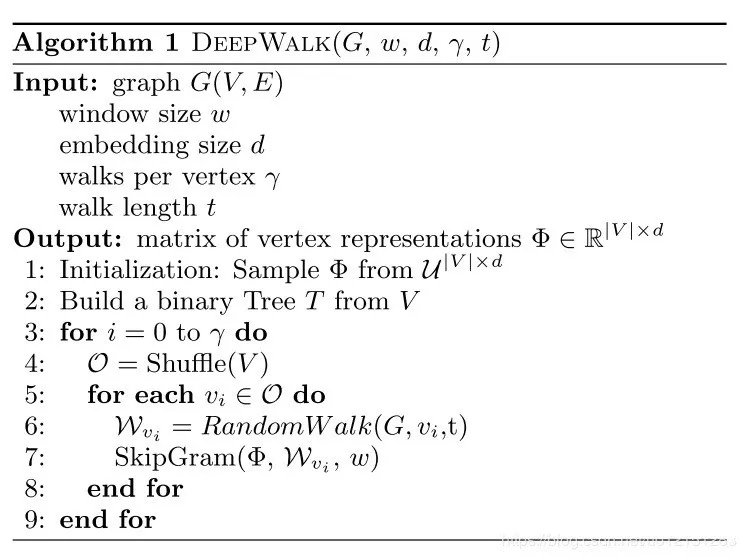

# Embedding 技术之 DeepWalk

原论文：**《DeepWalk：Online Learning of social representation》**

## 1. 论文背景

​		Word2Vec 和 其衍生出来的 Item2Vec 是 Embedding 技术的基础性方法，但是二者都建立在 “序列” 样本的基础上。在互联网场景下，数据之间更多呈现的是图结构数据。典型的场景是由用户行为数据生成的物品关系图·，以及由实体和属性组成的 知识图谱，如下图所示。

​		面对图结构的时候，传统的序列 Embedding 算法就显得力不从心了。在这样的背景下，Graph Embedding 技术成了新的研究方向，并逐渐在深度学习推荐系统领域流行起来。

​		Graph Embedding 是一种对图结构中的点进行 Embedding 编码的方法。最终生成的结点 Embedding 向量一般包含图的结构信息以及附近结点的局部相似性信息。

​		早期影响力比较大的 Graph Embedding 是Deep Walk，它的主要思想是在由物品组成的图结构上进行随机游走，产生大量的物品序列，然后将这些物品序列作为训练样本输入到 word2vec 中进行训练，得到物品的 Embedding。因此，DeepWalk 可以看作是链接序列 Embedding 和 Graph Embedding 的过度方法。

​		

## 2. 技术细节

​		论文一开始就提出了学习图结构数据中结点的 Embedding 表示的重要性，

#### 2.1 问题定义

​		问题定义为对图结构中的结点进行多分类任务。用 $G=(V,E)$ 表示一个图数据，其中 $V$ 代表结点，$E$ 代表图中的边，对于一个部分有标签的图，可以定义为 $G_L=(V,E,X,Y)$，$X\in R^{|V|\times S}$ 表示结点的属性信息，$Y\in R^{|V|\times |\upsilon|}$ 表示标签集合。传统的分类方法都是希望找到属性与标签之间的映射，但是使用Embedding 技术得到的向量中包含丰富的图结构信息以及结点的社交信息以及相似性等信息，可以利用这些信息提高分类的效果。论文中最终对于 Grap Embedding 有效性的说明，也是基于其对分类任务指标的提升来说明的。

#### 2.2 Graph Embedding （社交关系表示）的要求

​		对于学习 social representation，文中提出了以下要求：

- Adaptability：真实的社交网络是不断变化的，新的社交关系的引入，不应该要求从头开始学习（学习也应该是增量式的）；

- Community aware：学习到的 embeding 之间的某种相似性应该能反映结点对应的实体之间的某种相似性；

- Low dimensional: 当数据量很大的时候，低维的模型泛化性更好，并且能加速收敛’；

- Continuous：对于隐向量表示，要求是连续的，连续空间的决策边界更平滑，并且能让分类模型更加具有鲁棒性；

  

  **随机游走（Random Walk）：**

  ​		随机游走的方法已经在基于内容的推荐和社交检测等众多问题中作为相似性的衡量方法，基于这样的基础，论文中提出用随机游走的方式产生的序列来挖掘图中信息。此外，局部的随机游走还有两个好处，第一是局部的游走可以并行化进行；第二是基于局部随机游走产生的序列挖掘的方式，当图中结构发生微小变化的时候，不需要全部重新计算，只需要对发生改变的区域进行随机游走产生的序列进行增量式训练就行了。

  **语言模型（Language Model）：**

  ​		进过研究发现，随机游走产生的序列中的实体出现频率分布和自然语言中词频分布相似，都遵循指示式的长尾分布；所以考虑将自然语言处理中的方法引入进来。也即是将随机游走产生的序列当做句子，然后按照语言模型中预训练词向量的方式进行训练，最终得到结点实体的向量表示。

#### 2.3 方法

​		语言模型的输入是预料和词库，而 DeepWalk 将随机游走产生的结点序列作为预料，而结点中的所有结点就对应词库。

​		**Deep Walk：**

​		算法主要包括两个部分，其一是产生随机游走序列的 walker，其二是对产生的随机游走序列进行学习的算法；

​		第一部分的算法伪代码如下：

​		其中输入为图 $G(V,E)$，窗口大小 $w$，Embedidng 的维度 $d$，每一个实体作为起始点的次数 $\gamma$，随机游走的长度 $t$；

​		第二部分就是一个 word2vec 算法框架：

​		论文中使用的是基于 Hierachical Softmax 实现的 skip gram实现，但是实际的实现方式也可以是 Negative Sampling 的实现。

​		**并行化：**

​		因为社交图网络中随机游走产生的序列中结点出现的频率和自然语言中的词频一样，具有长尾分布，所以对于参数的更新是很稀疏的。所以这允许我们使用 ASGD （异步 SGD）并行化，也就是说因为参数的更新是很稀疏的，所以当一个 worker 对参数进行更新的时候，不需要获取锁这样的同步操作。

​		**变体：**

  1. Streaming （流式处理）

     不需要知道知道整个图的结构，随机游走序列一旦产生就送入 word2vec 进行学习，使用学习率衰减就不太可行了，取而代之的，我们将学习率初始化为一个很小的确定的常数，这会花费更多的时间训练；

  2. Non-random walks

     不再是随机游走，而是在基于一定的概率分布（权重）进行游走，这样生成的 Graph Embedding 不仅会捕获有关图结构的信息，还会有关图中权重的更多信息。

​		