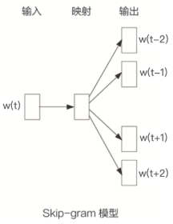

# Embeding 技术之 Item2Vec

​	原论文：**《Neural Item Embedding for Collabrotive Filtering》**

​	

## 1. 论文背景

​		这篇文章比较朴素，基本就是参照了 google 的 word2vec 方法，把 item2vec 应用到推荐场景的 i2i 相似度计算中，从实际效果看不错，主要思想是：把 item 看做是 word2vec 中的 word，用户行为序列看做一个集合（句子），item 间的共现为正样本，并按照 item 频率分布进行负采样。因此，item2vec 可以看作是 item2vec 的推广。item2vec 的本质就是 word2vec 中的 skip-gram + Negative sampling。

​		推荐系统中，传统的 CF 算法都是利用 item2item 关系计算商品相似性。i2i 数据在业界的推荐系统中起着重要的作用。

​		word2vec 把 word and phrases 映射到一个低维语义和句法的向量空间中，用 CBOW 和 skip-gram 两种方式。这里只是简单描述下 word2vec 中 skip-gram 相关知识，因为这部分与 item2vec 基本一致。

​		skip-gram 的模型架构如下所示：

​		其基本思想是利用当前词预测上下文词，给定一个训练序列 $w_1,w_2,...,w_T$，模型的目标函数是最大化平均的 $\log$ 概论：
$$
\frac{1}{T}\sum_{t=1}^T\sum_{-c\leq j\leq c,j\neq0}\log p(w_{t+j}|w_t)
$$
​		c 代表滑动窗口的大小，c 越大，训练样本也就是越大，准确率也就越高，同时训练时间也越长。在 skip-gram 中:
$$
p(w_j|w_i)=\frac{\exp(u_i^Tv_j)}{\sum_{k\in I_w}\exp(u_i^Tv_k)}
$$
​		W 表示整个语料库的带下，W 通常非常大，直接优化上面的公式，计算消耗是非常大的，为了解决这个问题，google 提出了两个解决办法，一个是 Hierachical softmax，另一个方式是 negative sample。

​		另外，由于自然语言中很多高频词出现频率极高，但是包含的信息量非常小，为了 balance 低频词和高频词，利用简单的概率丢弃词 $w_i$:
$$
P(w_i)=1-\sqrt{\frac{t}{f(w_i)}}
$$
​		其中 $f(w_i)$ 是 $w_i$ 的词频，$t$ 的确定比较 trick，启发式获得，实际中 $t$ 大约在 $10^{-5}$ 附近。

## 2. 模型介绍

​		顾名思义，Item2Vec 就是为 item 做 embedding 的方法。其思想是将用户的行为序列转化为 item 组成的句子，模仿 word2vec 训练 word embeding 将item 做 embedding。基本思想是把原来高维稀疏表示方式（one hot）映射到低维稠密的向量空间中，这样我们就可以利用这个低维向量来表示该项目，进而通过计算两个低维向量之间的相似度来衡量两个项目之间的相似性。

​		论文中介绍的是基于 Negative Sampling 的 Skip gram 模型。Item2Vec 算法的流程为：

- 从 $\log$ 中抽取用户行为序列；
- 将行为序列当成语料训练 word2vec 得到 item 的 Embedding 向量；
- 得到 item sim 关系用于推荐；

​		Item2vec 中把用户浏览的商品集合等价于 word2vec 中 word 序列。出现在同一集合的商品对视为正例，否则为负例。同一集合可以根据具体场景定义，例如：用户同一订单下的商品。对于集合 $\{w_1,w_2,...,w_K\}$ 的目标函数为：
$$
\frac{1}{K}\sum_{i=1}^K\sum_{j\neq i}^K\log p(w_j|w_i)
$$
​		同 word2vec 一样，利用负采样，将定义为：
$$
p(w_j|w_i)=\sigma(u_i^Tv_j)\prod_{k=1}^N\sigma(-u_i^Tv_k)
$$
​		subsample 的方式同样也是同 word2vec：
$$
p(discard|w)=1-\sqrt{\frac{\rho}{f(w)}}
$$
​		最终，利用 SGD 方法学习目标函数 max，得到每个商品的 embedding representation，商品之间两两计算 cosine 相似度即为商品相似度。

​		在某些场景下，比如 应用商店中，user 数量远远大于 item 数量。学习 item 之间相关关系的计算压力远远小于学习 item 与 user 的关系。

​		既然问题定位到学习 item 之间的相关关系，这里使用  skip-gram 的做法就是 item2vec 的灵魂所在了，item2vec 并灭有加入对时间信息的考量，因为序列数据产生的时间并不重要。继而，序列内 item 的相对位置也不重要，只是在一个序列内，所有 item 组成的 pair 对都是可以作为正样本的，也就是 skip-gram 的 window size 是自适应的，是和序列等长的。

## 3. 模型总结与补充

- **Item2vec 和 MF 的区别**

  ​		首先，二者都应用了 隐向量来表征实体特征，不同的是，传统的 MF 通常是 user-item 矩阵，而 Item2vec 通过滑动窗口样本生成的方式构造出的则更像是 item-item 矩阵；另外，二者得道隐向量的方式也不通过，MF 利用均方差损失，使得预测得分与已有得分之间的误差尽可能地小，而 Item2vec 则是利用空间信息并借助了最大似然估计的思想，使用对数损失，使得上下文关系或者共现关系构造出的正样本的 item Pair 出现的概率尽可能大；此外训练 Item2vec 的时候还要引入负样本，这也是与 MF 不同的地方。

- **为什么选择的是 SGNS 而不是其他的组合**

  ​		因为这种效果最好，很多文章也提到了采用 Skip-Gram + Negative Sampling 的方法是最好的；

- **Item2vec 基于 SGNS 的改进点**

  ​		其改进点为，修改 windows size 为 set size 的长度，即从原来的定长变成了变长，其他的保持不变。

  ​		Item2vec 丢失了集合中的时间和空间信息。

- **Item2vec 的等效表达**

  ​		论文中指出采用保持 word2vec 的 SGNS 不变，仅仅将 set 集合中的 item 进行随机的排序就可以达到和 Item2vec 同样的效果，其他的相关实验也进行了佐证；

  ​		因此在很大程度上方便了 Item2vec 的等效表达，即采用word2vec 的算法代码同样可以得到 item2vec 中的 item 的 Embeding 表示。

