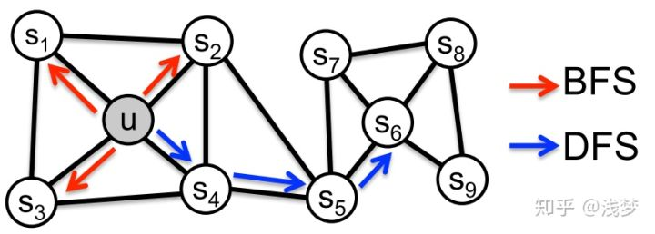

# Embedding 技术之 Node2Vec

原论文：**《node2vec: Scalable Feature Learning for Networks》**

### 论文背景

​		在前人的基础（DeepWalk、LNIE）上，斯坦福大学的研究人员进一步提出了 Node2Vec 模型，它通过调整随机游走权重的方法是 Graph Embedding 的结果更倾向于体现网络的同质性（homophily）或 结构性（structural equivalence）。

​		具体地讲，同质性 是指网络中距离相近的结点的 Embedding 应该尽量相似，如下图所示。点与 $u$ 与其相近的 $s_1,s_2,s_3,s_4$ 的 Embedding 向量应该尽量近似，这就是网络 “ 同质性 ” 的表现；而 “结构性” 指的是结构上相似的结点应该具有相似的 Embedding，图中 $u$ 和 $s_6$ 在结构上更加相似，具都处于中心位置，那么从 "结构性" 上来说，二者是相似的，那么在 Embedding 向量上应该具有一定的相似性。而之前的 DeepWalk 更能体现 同质性，而 LINE 更偏向于结构性，但是显然无论是 同质性 还是 结构性 都应该是有用的信息。

​		论文中提到，为了使 Graph Embedding 的结果能表达网络的 “结构性”，在随机游走的过程中，需要让游走的过程更加倾向于 BFS，因为 BFS 会更多地在当前结点的邻域中游走遍历，相当于对当前结点周边周边的网络结构进行一次 “微观扫描”。当前结点是 “局部中心结点” 还是 “边缘结点” 或是 “连接性“ 结点，其生成的序列包含的结点数量和顺序必然是不同的，从而最终 Embedding 抓取到更多结点的结构性信息。

​		另外，为了表达 “同质性”，需要让随机游走的过程更加倾向于 DFS，因为 DFS 更有可能通过多次跳转，游走到远方的结点上，但是无论怎么样，DFS 的游走更大概率会在一个大的集团内部进行游走，这就使得一个集团或者一个社区内部结点的 Embedding 更加相似，从而更多地表达网路的同质性。

​		

### 主要方法

​		那么在论文提出的 Node2Vec 的方法具体是怎么做的呢？

​		**优化目标**：

​		设置 $f(u)$ 是顶点 $u$ 映射为 Embedding 向量的映射函数，对于图中的每一个顶点 $u$ ,定义 $N_s(u)$ 为通过采样策略 $S$ 采样出来的顶点 $u$ 的近邻顶点集合。

​		node2vec 优化的目标是在给定每个顶点条件下，令其近邻顶点出现的概率最大。即：
$$
\max_f\sum_{u\in V}\log Pr(N_s(U)|f(u))
$$
​		为了将上面的最优化问题可解，文中提出了两个假设：

- 条件独立性假设

  假设给定源顶点下，其近邻顶点出现的概率与近邻集合中其余顶点无关，也即是：
  $$
  Pr(N_s(u)|f(u))=\prod_{n_i\in N_s(u)}Pr(n_i|f(u))
  $$

- 特征空间对称性假设

  这里是说一个顶点作为源点和作为近邻顶点的时候共享同一套 Embeding 向量，（对比 LINE 中的 2 阶相似度，一个顶点作为源点和近邻点的时候是拥有不同的  embeding 向量的）在这个假设下，上述条件概率公式可以表示为：
  $$
  Pr(n_i|f(u))=\frac{\exp f(n_i).f(u)}{\sum_{v\in V}\exp f(v).f(u)}
  $$
  根据上面的两个假设条件，最终的目标函数为：
  $$
  \max_f\sum_{u\in V}[-\log Z_u +\sum_{n_i\in N_s(u)}f(n_i).f(u)]
  $$
  由于归一化因子 $Z_u=\sum_{n_i\in N_s(u)}\exp(f(n_i).f(u))$ 的计算代价太高，所以最终还是采用的负采样技术，也就说，最终还是跟 DeepWalk 一样，使用 word2vec 完成最终的 embedding 训练，只不过生成序列的方式变了。

  

  **顶点序列采样策略：**

  ​		node2vec 依然采用随机游走的方式获取顶点的近邻序列，不同的是 node2vec 采用的是一种有偏的随机游走，当给定当前顶点 $v$，访问下一个顶点 $x$ 的概率为：
  $$
  P(c_i=x|c_{i-1}=v)=\frac{\pi_{vx}}{Z},\ \ \ (v,x)\in E
  $$
  ​		其中 $\pi_{vx}$ 是顶点 $v$ 和 $x$ 之间的为归一化概率 , $Z$ 是归一化常数。

  ​		node2vec 通过引入两个超参数 $p$ 和 $q$ 来控制随机游走的策略，假设当前游走经过边 $(t,v)$ 到达顶点 $v$，设 $\pi_vx=\alpha_{pq}(t,x).w_{vx}$，其中 $w_{vx}$ 是顶点 $v$ 和 $x$ 之间的边权重。

  ​		而:

  

  ​		$d_{tx}$ 表示 $t$ 和 $x$ 之间的最短距离，下面讨论参数 $p$ 和 $q$ 的作用：

  - Return Parameter, p

    ​		该参数控制重复访问刚刚访问过的结点的概率，注意到 p 仅仅作用于 t，也就是 v 刚刚访问过的结点；如果 p 较低，那么 v 结点将有较高的概率回到刚刚的结点；反之如果 p 较高，那么回到刚刚结点的概率就会降低。

  - In-Out Parameter, q

    ​		q 控制着有这是向外还是向内，若 $q>1$，随机游走倾向于访问和 t 接近的顶点，（偏向于 BFS），而如果 $q<1$ 时，倾向于原理 t 的顶点（倾向于 DFS）。

    下面是代码：

    

    可以看到整体的架构就是 $\pi$ 的计算和基于其的 $AliasSample$ 采样部分与 DeepWalk 不同。

### 总结

​		Node2Vec 这种灵活表达同质性和结构性的特点也得到了实验的证实，通过调整参数 $p$ 和 参数 $p$ 产生了不同的 Embedding 结果，如下图所示。

​		上面的图更注重同质性的体现，可以看到距离相近的结点颜色更加接近，而下面的图更加注重体现结构性，其中结构特点相近的结点的颜色更为接近。

​		Node2Vec 所体现的网络的同质性和结构性在推荐系统中可以被直观地解释。同质性相同的物品很可能是同品类、同属性，或者经常被一同购买的商品（因为通常建立的图就是根据这样的性质建立起来的，所以同质性的商品可能是邻近的商品，也就是一同被购买的商品，很可能是同品类，同属性的）。而结构性相同的物品则是在图中处于结构相似的地方的物品，很可能是各品类的爆款，各品类的最佳凑单商品等拥有类似趋势或者结构性属性的商品。

​		毫无疑问，以上两种特征在推荐系统中都是非常重要的特征表达。由于 Node2vec 这种灵活性，以及发掘不同图特征的能力，甚至可以把不同 Node2Vec 生成的偏向 "结构性" 的 Embedding 和 偏向 “同质性” 的 Embedding 结果共同输入后续的深度学习网络，以保留物品不同图特征信息。