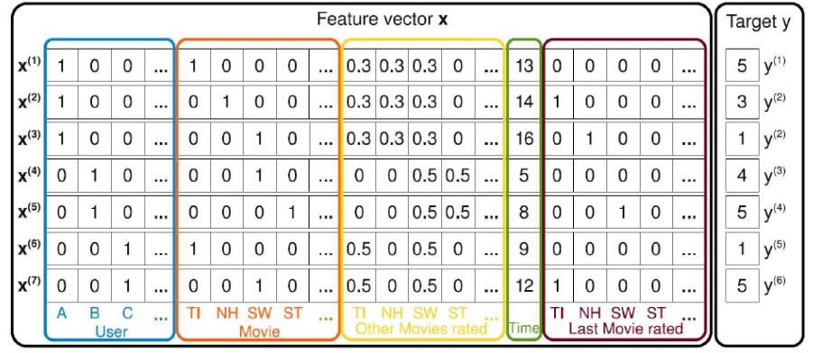

# 因子分解机（FM、FFM）

​		因子分解机（FM）本身是一个可以用于回归、二分类、排名等任务的机器学习模型，特别是在数据稀疏的场景下，仍然具有很好的效果，广泛应用于推荐系统、广搞预估等领域。

​		目前看来，因子分解机是从事推荐系统、计算广告领域必会的基础模型之一。在计算广告和推荐系统中，CTR 预估和转化率 CVR 估计是非常重要的一个环节。判断一个物品是否进行推荐需要根据 CTR 预估的点击率排序决定。业界常用的方法有 **人工特征工程+LR**、**GBDT + LR**、**FM** 和 **FFM** 等。在进行 CTR 预估时，除了单特征外，往往要对特征进行组合。对于特征组合来说，业界现在通用的做法主要有两大类: FM系列 与 Tree系列。

​		本文介绍基础的因子分解机（FM）以及其衍生出的更一般的场感知因子分解机（FFM），关于因子分解机与深度学习的结合将在另一篇文章中介绍。

## 1. 因子分解机（FM）

 #### 1.1 预测任务

​		在机器学习中，预测是一项最基本的任务，预测也就是需要估计一个函数 $f$ , 该预测函数将一个 $n$ 维实值特征向量 $x\in R^n$ 映射到一个目标域 $T$，可以是回归问题，也可以是分类问题。

​		在现实世界中，许多应用问题（比如：文本分类、推荐系统等）会产生高纬度的稀疏数据，也即是特征向量中几乎所有的分量都是 0，比如下面是一个电影评分的例子。

​		**例：**考虑电影评分系统中的数据，它的每一条记录都包含了那个用户 $u∈U$ 在什么时候 $t∈R$ 对那部电影 $i∈I$ 打了多少分 $r∈\{1,2,3,4,5\}$ 这样的信息。假定用户集 $U$ 和电影集 $I$ 分别为:
$$
U=Alice(A),Bob(B),Charlie(C),...
$$

$$
I=TItanic(TI),NothingHill(NH),StarWars(SW),StarTrek(ST),...
$$

 设观测到的数据集S为：
$$
S={(A,TI,2020-1,5), (A, NH, 2010-2, 3), (A, SW, 2010-4, 1), (B, SW, 2009-5, 4), (B, ST,2009-8, 5), (C, TI, 2009-9, 1), (C, SW, 2009-12, 5),...}
$$
​		利用观测数据集S来进行预测任务的一个实例是：估计一个函数 $\hat y$ 来预测某个用户在某个时刻对某部电影的打分行为。

​		利用上面的数据，可以构造数据样本如下图所示：

- 第一部分（对应蓝色方框）表示**当前评分用户信息**，其维度为 $|U|$，该部分的分量中，当前电影评分用户所在的位置为 1，其他为 0。

- 第二部分（对应红色方框）表示**当前被评分电影信息**，其维度为 $|I|$，该部分的分量中，当前被评分的电影所在的位置为1，其他为0。
- 第三部分（对应黄色方框）表示**当前评分用户评分过的所有电影信息**，其维度为 $|I|$，该部分的分量中，被当前用户评论过的所有电影(设个数为 $n_I$ )的位置为 $\frac{1}{n_I} $，其他为 0。
- 第四部分（对应绿色方框）表示**评分日期信息**，其维度为1，用来表示用户评价电影的时间，表示方法是将（记录中最早的日期）2009年1月作为基数1，以后每增加1个月就加1。
- 第五部分（对应棕色方框）表示**当前评分用户最近评分过的一部电影的信息**，其维度为 $|I|$ ，该部分的分量中，如当前用户评价当前电影之前还评价过其它电影，则将当前用户评价的上一部电影的位置取为 1，其他为 0；若当前用户评价当前电影之前没有评价过其他的电影，则所有的评分都取为 0。

​		当然，上面的关于特征组合和特征数值化的方式，不是固定不变的，在不同的场景下，算法工程师们可能会采用的不同的特征组合方式。在上面的例子中，特征向量的维度为 $|U| +3|I|+1$，在实际的推荐系统中，这将是一个很大的维度，而且非常稀疏。为了定量刻画这种稀疏，记 $N_z(x)$ 表示 $x$ 中非零分量的个数，并记：
$$
\overline{N_z(x)}=\frac{1}{m}\sum_{i=1}^mN_z(x^{(i)})
$$
​		对于稀疏数据而言，显然有：$\overline{N_z(x)}<<n$

#### 1.2 二阶模型		

​		在介绍FM的模型方程之前，先讲一下线性回归。对于一个给定的特征向量 $x=(x_1,x_2,…,x_n)^T$，线性回归建模时采用的函数是
$$
\hat y(x)=w_0+w_1x_1+w_2x_2+⋯+w_nx_n=w_0+∑_{i=1}^nw_ix_i
$$
 	其中，$w_0$ 和 $w=(w_1,w_2,…,w_n)^T$ 为模型参数。从方程易见：各特征分量 $x_i$ 和 $x_j(i≠j)$ 之间是相互孤立的，即仅考虑单个的特征分量，而没有考虑特征分量之间的相互关系(interaction)。

 	为了表示特征交叉，可以将$\hat y(x)$ 改写为
$$
\hat y(x)=w_0+∑_{i=1}^nw_ix_i+∑_{i=1}^{n−1}∑_{j=i+1}^nw_{ij}x_ix_j
$$
 	这样任意连个互异特征分量之间的关系也考虑进来了。不过，这种直接在 $x_ix_j$ 前面配上一个系数 $w_{ij}$ 的方式在稀疏数据中有一个很大的缺陷，例如在上例中，观测集 $S$ 中没有 $Alice$ 评价电影 $Star Trek$ 的记录，如果直接估计 $Alice(A)$ 和 $Star Trek(ST)$ 之间，或者说特征分量 $x_A$ 和 $x_{ST}$ 之间的相互关系，显然会得到系数 $w_{A,ST}=0$。即对于观测样本中未出现过交互的特征分量，不能对相应的参数进行估计。注意，在高度稀疏数据场景中，由于数据量的不足，样本中出现未交互的特征分量是很普遍的。

​		为克服这个缺陷，在系数 $w_{ij}$上做文章，将其表示成另外的形式。为此，针对每个维度的特征分量 $x_i$，引入辅助分量
$$
v_i=(v_{i1},v_{i2},...,v_{ik})^T∈R^k,i=1,2,...,n
$$
 	其中 $k∈N^+$为超参数，并将 $w_{ij}$ 改写为
$$
\hat w_{ij}=v_i^Tv_j=∑_{l=1}^kv_{il}v_{jl}
$$
​		这样就能克服上面提到的缺陷了?我们粗略地分析一下。在观测数据中，$Bob(B)$ 对 $Star Wars(SW)$ 和 $Star Trek(ST)$ 的评分差不多，由此可认为它们对应的辅助向量 $vST$ 和 $vSW$ 也比较相似。从而，利用 $\hat w_{A,SW}$ 就可以对 $\hat w_{A,ST}$ 进行估计了。(当然，这里并不是说，真的要先计算出 $\hat w_{A,SW}$然后用它作为$\hat w_{A,ST}$的近似。因为这些性质都是观测数据中内在的，我们要做的只是建好模型，让模型在训练阶段自动去学习。)
 	于是，函数 $\hat y$ 可以进一步改写为：
$$
\hat y(x)=w_0+∑_{i=1}^nw_ix_i+∑_{i=1}^{n−1}∑_{j=i+1}^{n}(v_i^Tv_j)x_ix_j\\=w_0+∑_{i=1}^nw_ix_i+\frac{1}{2}[∑_{i=1}^{n}∑_{j=1}^{n}(v_i^Tv_j)x_ix_j-\sum_{i=1}^n(v_i^Tv_i)x_i^2]
$$
​		事实上，我们可以很容易证明这种上面的表达式可以表示任意的式 $(6)$ 所表达的关系 ，对于任意的式 $(6)$ 我们都可以写成这样的形式：
$$
\hat y(x)=w_0+∑_{i=1}^nw_ix_i+\frac{1}{2}[∑_{i=1}^{n}∑_{j=1}^nw_{ij}x_ix_j-\sum_{i=1}^nw_{ii}x_i^2]
$$
 	也就是二次型减去其对角线元素，我们可以定义 $w_{ii}$ 使得二次型矩阵为半正定矩阵，根据矩阵分解的相关知识，对于实对称半正定矩阵 $W$ ，当 $k$ 足够大时，对于任意对称正定的实矩阵 $W∈R^{n×n}$，均存在实矩阵 $V∈R^{n×k}$，使得成立 $W=VV^T$。
 	理论分析中，我们要求参数 $k$ 取得足够大，但是，在高度稀疏数据场景中，由于没有足够的样本来估计复杂的交互矩阵，因此 $k$ 通常应取得很小。事实上，对参数 $k$ (亦即 $FM$ 的表达能力)的限制，在一定程度上可以提高模型的泛化能力。这种能够利用 $W$ 的低秩近似的性质也是 $FM$ 的一个优势。

​		按照式 $(9)$ 的表达式计算，时间复杂度为 $O(kn^2)$，我们如果按照下面的化简形式计算，时间复杂度可以降低到 $O(kn)$，也就是线性时间复杂度。
$$
\hat y(x)=w_0+∑_{i=1}^nw_ix_i+\frac{1}{2}[∑_{i=1}^{n}∑_{j=1}^{n}(v_i^Tv_j)x_ix_j-\sum_{i=1}^n(v_i^Tv_i)x_i^2]\\=w_0+\sum_{i=1}^nw_ix_i+\frac{1}{2}\sum_{f=1}^k[(\sum_{i=1}^nv_{if}x_i)^2-\sum_{i=1}^nv_{if}^2x_i^2]
$$
​		

#### 1.3 推广到高阶

​		前面描述的 $FM$ 模型方程包含各个特征分量，以及任意两个特征分量之间相互关系的项。我们将这种方程称为 $2-way$ (或二阶)$FM$方程。接下来，我们将它进一步推广位 $d-way(d>=2)FM$方程，即方程可以同时刻画任意 $l~(1≤l≤d)$ 个特征分量之间的相互关系。此时，方程可以定义为
$$
\hat y(x)=w_0+\sum_{i=1}^nw_ix_i+\sum_{l=2}^d[\sum_{i_1=1}^{n−(l−1)}\sum_{i_2=i_1+1}^{n−(l−2)}⋯\sum_{i_l=i_{l−1}+1}^n(\prod_{j=1}^l⁡x_{i_j})(\sum_{k=1}^{k_l}\prod_{j=1}^l⁡v_{i_jk}^{(l)})]
$$

$$
V^{(l)}∈R^{n×k_l}，k_l∈N+
$$

 	易知，公式上式的计算复杂度为 $O(k_dn^d)$。

#### 1.4 模型优化（SGD）

​		下面介绍二阶因子分解机的优化算法，关于 $FM$ 模型的优化，在论文中提出了三种算法，此处只介绍其中最简单最好理解的一种，随机梯度下降 $(SGD)$。

​		前面已经提到过，利用因子分解机模型方程可以做各种任务，回归、分类、排名等等，下面将介绍回归和二分类问题中，目标函数的优化，我们假设一共有 $m$ 个样本，则目标函数通常为：
$$
L=\sum_{i=1}^mloss(\hat y(x^{(i)}),y^{(i)})
$$
​		设参数为  $\theta$，则梯度为：
$$
\frac{\partial L}{\partial\theta}=\sum_{i=1}^m\frac{\partial loss(\hat y(x^{(i)}),y^{(i)})}{\partial \hat y(x^{(i)})}\frac{\partial \hat y(x^{(i)})}{\partial\theta}
$$
​		根据公式 $(11)$ 不难得到：
$$
当 \theta=w_0 时，\frac{\partial{\hat y(x)}}{\partial\theta}=1\\当\theta=w_i,i=1,2,...,n时，\frac{\partial{\hat y(x)}}{\partial\theta}=x_i\\当\theta=v_{if}时，\frac{\partial{\hat y(x)}}{\partial\theta}=x_i\sum_{j=1}^nv_{jf}x_j-v_{if}x_i^2
$$
​		**二分类问题：**

​		在二分类问题中如果类别分别为 $+1,-1$，一般采用 $logit\ loss$ 损失函数，其形式为：
$$
loss(\hat y,y)=-\ln\sigma(\hat yy)
$$
​		其中 $\sigma(x)=\frac{1}{1+e^{-x}}$ 可以证明，等价于类别标签为 $+1,0$ 下的交叉熵损失函数。

​		很容易得到：
$$
\frac{\partial loss(\hat y,y)}{\partial \hat y}=y[\sigma(\hat yy)-1]
$$
​		**回归问题：**

​		在回归问题中，损失函数一般采用平方损失函数，其形式为：
$$
loss(\hat y, y)=\frac{1}{2}(\hat y-y)^2
$$
​		很容易得到：
$$
\frac{\partial loss(\hat y,y)}{\partial \hat y}=\hat y-y
$$
​		

#### 1.5 总结

- 因子分解机在数据高维且稀疏的情况下依然适用；

- 因子分解机能在线性时间复杂度内进行计算；
- 因子分解机能解决包括分类、回归、排序等问题在内的多种预测问题；
- 因子分解机的特征是显式的，其特征自动组合，不需要人工参与，一般情况下，类别特征在输入因子分解机之之前需要 $one-hot$ 处理

#### 1.6 因子分解机与其他模型的关系

​		这里的 $v_i$ 是 $x_i$ 特征的低维稠密表达，实际中隐向量的长度 $k$ 通常远小于特征维度 $n$ 。$FM$ 学到的隐向量可以看做是特征的一种 $embedding$ 表示，把离散特征转化为 $Dense Feature$，这种 $Dense Feature$ 还可以后续和 $DNN$ 结合，作为 $DNN$ 的输入，事实上用于 $DNN$ 的 $CTR$ 也是这个思路来做的。

​		从上面的叙述来看，$FM$ 的二阶矩阵也用了矩阵分解的技巧，那么基于矩阵分解的协同过滤和 $FM$ 是什么关系呢？以 $use$ r对 $item$ 评分预测问题为例，基于矩阵分解的协同过滤可以看做 $FM$ 的一个特殊例子，对于每一个样本，$FM$ 可以看做特征只有 $user_id$ 和 $item_id$ 的 $one_hot$ 编码后的向量连接而成的向量。从 $FM$和 $BiasSVD$ 公式来看，$BiasSVD$ 的用户向量 $p_u$ 和 $item$ 向量 $q_i$ 可以看做 $FM$ 中的隐向量，$user$ 和$ iterm$ 的 $bias$ 向量 $b_u,b_i$ 就是 $FM$ 中的一次项系数，常数 $μ$ 也和 $FM$ 中的常数 $w_0$ 相对应，可以看到，**$BiasSVD$ 就是FM的一个特例**!另外，$FM$ 可以采用更多的特征，学习更多的组合模式，这是单个矩阵分解的模式所做不到的！因此，$FM$ 比矩阵分解的方法更具普遍性！事实上，现在能用矩阵分解的方法做的方案都直接上 $FM$ 了！

​		神经网络天然地难以直接处理高维稀疏的离散特征，因为这将导致神经元的连接参数太多。但是低维嵌入（embedding）技巧可以解决这个问题，词的分布式表达就是一个很好的例子。事实上 **FM就可以看做对高维稀疏的离散特征做 embedding**。神经网络对稀疏离散特征做 embedding 后，可以做更复杂的非线性变换，具有比FM跟大的潜力学习到更深层的非线性关系！基于这个思想，2016年，Google提出 wide&deep 模型用作 Google Play的app推荐，它利用神经网络做离散特征和连续特征之间的交叉，神经网络的输出和人工组合较低维度的离散特征一起预测，并且采用端到端的学习，联合优化 DNN 和 LR。

## 2. 场感知因子分解机（FFM）

#### 2.1 模型的引入

​		根据名字就可以知道，$FFM$ 模型是在 $FM$ 的基础上做了一些改进和扩展得到的，也就是引入了 **特征感知域** 这一概念。所谓的 **域（field）** 可以直观理解为特征的类别，比如用户性别、职业、偏好等等，显然通常在推荐算法中，我们的特征向量会融合各个方面的特征，所以一般会存在多个域，$FFM$ 的提出正是为了要更好地利用这些信息。下面是论文中的一个例子。

​		其中 $Publoisher,\ Advertiser,\ Gender$ 这是三个特征域，$ESPN,\ NIKE,\ Male$ 分别是这三个特征域的特征值。（实际转换为特征时还会 $one-hot$ 处理）。如果按照 $FM$ 的原理，特征 $ESPN,\ NIKE,\ Male$ 应该分别有隐向量 $W_{ESPN}、W_{NIKE}、W_{Male}$ ，那么特征  $ESPN$ 与另外两个特征之间的交叉权重应该分别为 $W_{ESPN}.W_{NIKE}$ 和 $W_{ESPN}.W_{Male}$ 。也就是说，在考虑 $ESPN$ 和其他特征的交叉时，其特征向量是不变的，也就是没有域感知的概念。

​		但是我们凭借经验和直觉，某一特征与不同类型的特征之间交叉时，其影响因子应该是不同的，也就是说应该具有不同的隐向量。在上面的例子中，我们假设 $ESPN$ 在与另外两个特征$（Advertiser,\ Gender）$进行交叉时，分别具有不同的隐向量（另外的特征亦是如此），那么 $ESPN$ 与另外两个特征之间的交叉权重应该变成为 $W_{ESPN,A}.W_{NIKE,P}$ 和 $W_{ESPN,G}.W_{Male,P}$ 。

#### 2.2 模型的数学表达

​		根据 $FM$ 模型的数学表达式以及上面的叙述，不难给出 $FFM$ 模型的数学表达。

​		假设样本的 $n$ 个特征属于 $f$ 个 $field$ ，那么 $FFM$ 的二次项有 $nf$ 个隐向量。而在 $FM$ 模型中，每一维特征的隐向量只有一个。$FM$ 可以看作 $FFM$ 的特例，是把所有特征都归属到一个 $field$ 时的 $FFM$ 模型。根据 $FFM$ 的 $field$ 敏感特性，可以导出其模型方程。
$$
\hat y(x)=w_o+\sum_{i=1}^nw_ix_i+\sum_{i=1}^{n-1}\sum_{j=i+1}^nv_{i,f_j}^Tv_{j,f_i}x_ix_j
$$
​		其中，$f_j$ 是第 $j$ 个特征所属的 $field$。如果隐向量的长度为 $k$，那么 $FFM$ 的二次参数有 $nfk$ 个，多于FM模型的 $nk$ 个。此外，由于隐向量与 $field$ 相关，$FFM$ 二次项并不能够化简，其预测复杂度是 $O(kn^2)$。

#### 2.3 模型的优化

​		$FFM$ 模型的训练一般采用随机梯度下降 $SGD$ 。我们针对二分类问题 $FFM$ 的优化（事实上，$FFM$ 主要也是应用于二分类问题）,给出模型参数的优化推导过程。

​		首先给出目标函数，为了提高模型泛化能力，降低过拟合，引入了 $L_2$ 正则化：
$$
L=\sum_{i=1}^mloss(\hat y(x^{(i)}),y^{(i)})+\frac{\lambda}{2}||\theta||^2_2
$$
​		则梯度为：
$$
\frac{\partial L}{\partial\theta}=\sum_{i=1}^m\frac{\partial loss(\hat y(x^{(i)}),y^{(i)})}{\partial \hat y(x^{(i)})}\frac{\partial \hat y(x^{(i)})}{\partial\theta}+\lambda\theta
$$
​		根据公式 $(11)$ 不难得到：
$$
当 \theta=w_0 时，\frac{\partial{\hat y(x)}}{\partial\theta}=1\\当\theta=w_i,i=1,2,...,n时，\frac{\partial{\hat y(x)}}{\partial\theta}=x_i\\当\theta=v_{i,f_j}时，\frac{\partial{\hat y(x)}}{\partial\theta}=x_ix_jv_{j,f_i},其中，i，j都是非零特征，且i\neq j 
$$
​		

​		在二分类问题中如果类别分别为 $+1,-1$，一般采用 $logit\ loss$ 损失函数，其形式为：
$$
loss(\hat y,y)=-\ln\sigma(\hat yy)
$$
​		其中 $\sigma(x)=\frac{1}{1+e^{-x}}$ 可以证明，等价于类别标签为 $+1,0$ 下的交叉熵损失函数。

​		很容易得到：
$$
\frac{\partial loss(\hat y,y)}{\partial \hat y}=y[\sigma(\hat yy)-1]
$$
​		在原论文中，作者采用的是加入了二阶动量和自适应学习率的 Adgrad 算法：
$$
G_\theta=G_\theta+||\frac{\partial L}{\partial \theta}||^2\\\theta\leftarrow\theta-\frac{\eta}{\sqrt{G_\theta}}\frac{\partial L}{\partial\theta}
$$

#### 2.4 工程技巧

​		在 $FFM$ 模型的训练中，有许多小细节和技巧需要关注；

​		在DSP的场景中，$FFM$ 主要用来预估站内的 $CTR$ 和 $CVR$，即一个用户对一个商品的潜在点击率和点击后的转化率。

​		$CTR$ 和 $CVR$ 预估模型都是在线下训练，然后用于线上预测。两个模型采用的特征大同小异，主要有三类：用户相关的特征、商品相关的特征、以及用户-商品匹配特征。用户相关的特征包括年龄、性别、职业、兴趣、品类偏好、浏览/购买品类等基本信息，以及用户近期点击量、购买量、消费额等统计信息。商品相关的特征包括所属品类、销量、价格、评分、历史 $CTR/CVR$ 等信息。用户-商品匹配特征主要有浏览/购买品类匹配、浏览/购买商家匹配、兴趣偏好匹配等几个维度。

​		为了使用 $FFM$ 方法，所有的特征必须转换成 $“field\_id:feat\_id:value”$ 格式，field_id 代表特征所属 field 的编号，feat_id 是特征编号，value 是特征的值。数值型的特征比较容易处理，只需分配单独的 field 编号，如用户评论得分、商品的历史 CTR/CVR 等。categorical 特征需要经过 One-Hot 编码成数值型，编码产生的所有特征同属于一个 field，而特征的值只能是0或1，如用户的性别、年龄段，商品的品类id等。除此之外，还有第三类特征，如用户浏览/购买品类，有多个品类 id 且用一个数值衡量用户浏览或购买每个品类商品的数量（这一类与评分不同在于，评分是一个固定范围内的数值，而此类数值是的变化范围可以很大）。这类特征按照 categorical 特征处理，不同的只是特征的值不是 0 或 1，而是代表用户浏览或购买数量的数值。按前述方法得到 field_id 之后，再对转换后特征顺序编号，得到 feat_id，特征的值也可以按照之前的方法获得。(如果对于新出现的一个要预测的用户，其购买数量之前没有出现过呢？我们是否可以采用方法将其归为最近的一类呢？)

- 样本归一化，样本 $i$ 的归一化系数为 $R[i]=\frac{1}{∥X[i]∥}$，如果不做归一化处理，很容易造成数据溢出，进而造成梯度为 $nan$ 的情况。
- 特征归一化，$CTR/CVR$ 模型采用了多种类型的源特征，包括数值型和 $categorical$ 类型等。但是，$categorical$ 类编码后的特征取值只有0或1，较大的数值型特征会造成样本归一化后 categorical 类生成特征的值非常小，没有区分性。例如，一条用户-商品记录，用户为“男”性，商品的销量是 5000个（假设其它特征的值为零），那么归一化后特征 “sex=male”（性别为男）的值略小于0.0002，而“volume”（销量）的值近似为1。特征“sex=male”在这个样本中的作用几乎可以忽略不计，这是相当不合理的。因此，将源数值型特征的值归一化到 [0,1][0,1] 是非常必要的。
- 省略零值特征。从 $FFM$ 模型的表达式可以看出，零值特征对模型完全没有贡献。包含零值特征的一次项和组合项均为零，对于训练模型参数或者目标值预估是没有作用的。因此，可以省去零值特征，提高 $FFM$ 模型训练和预测的速度，这也是稀疏样本采用 $FFM$ 的显著优势。

#### 2.5 模型总结

​		从理论上分析，$FFM$ 参数因子化方式具有一些显著的优势，特别适合处理样本稀疏性问题，且确保了较好的性能；从应用结果来看，站内 $CTR/CVR$ 预估采用 $FFM$ 是非常合理的，各项指标都说明了 $FFM$ 在点击率预估方面的卓越表现。

