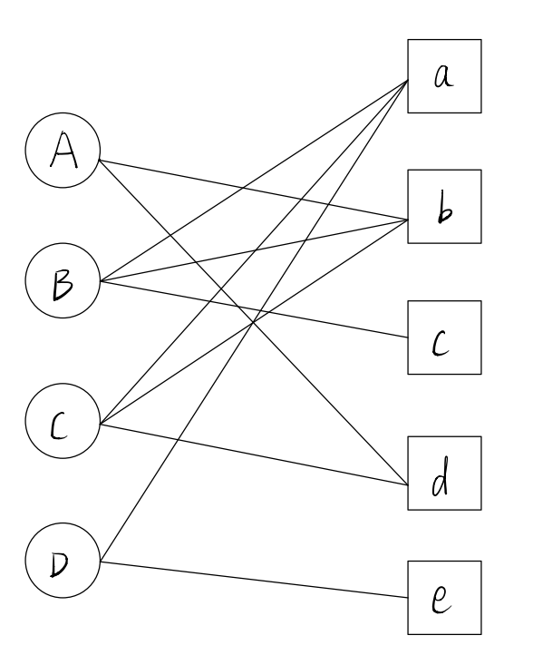

# 基于领域的协同过滤

​		协同过滤（Collaborative Filtering，CF）是一种利用集体智慧，借鉴相关人员的观点进行信息过滤的方法。

​		**协同过滤的算法假设为：**

1. 物以类聚，人以群分；
2. 过去兴趣相似的用户在未来的兴趣也会相似；
3. 相似的用户会产生相似的（历史）行为数据；
4. 相似或相关的项目会经常一起出现（被同意用户或是相似用户点击、观看、购买等）；
5. 用户会喜欢相似用户有过正反馈的项目；

​		基于以上假设，协同过滤根据大量得到用户历史行为数据，计算用户之间（或项目之间，用户和项目之间）的相似度或相关度，然后基于这些关联性为用户推荐。

​       

​		**算法分类：**

​		*根据算法思想*：

​		1.基于领域的协同过滤：将整个数据集存放在内存中，在推荐时，通过直接在内存中查找相似用户或者项目以给出推荐列表，常见比如：基于用户的协同过滤和基于项目的协同过滤等。 

​		2.基于模型的协同过滤：需要预先训练出一个抽象模型，在推荐时，根据推荐模型计算出推荐列表，常见的如：关联规则模型、隐语义模型、矩阵分解模型等。

​		*根据面向的应用问题：*

​		1.评分预测算法：根据历史用户评分数据，预测用户对候选项目的评分值；

​		2.Top-N推荐：根据历史用户行为数据，针对目标用户，对候选项目进行排序，并给出排在最前面的N个项目列表。

​		**一般流程：**

​		协同过滤的一般流程包括收集数据、寻找领域（或模型训练）、计算推荐结果几个基本步骤。

1. 收集数据主要是要收集能够反映用户偏好和项目特性的数据；

   ​		用户行为数据可以分为**显示反馈**和**隐式反馈**，前者指系统或平台显示从用户那里得到的用户偏好数据，比如评分、评级等等；后者指隐含用户对项目偏好的用户行为数据，比如浏览、点击、购买、评论、保存书签等。相比于显示反馈，隐式反馈数据更容易获取，数据量更大。

2. 寻找邻域（或训练模型）

   ​		寻找邻域的关键在于计算相似度，选定相似度度量标准之后，计算用户（或项目）之间的相似度，然后根据计算结果选择最相似的一组用户（或项目）作为邻域。

3. 计算推荐结果

   ​		基于邻域的的协同过滤会根据找到的邻域确定候选项目集合，然后根据候选项目集确定最终推荐结果。

## 1.基于用户的协同过滤

- 从给定目标用户的角度看，基于用户的协同过滤主要有以下三个流程：
  - 计算用户之间的相似度，并寻找和目标用户兴趣相似的用户集合，称为用户邻域；
  - 根据用户的行为数据，生成候选项目集；
  - 根据用户之间的相似度计算目标用户对候选项目集的感兴趣程度，并生成推荐列表；
- 从整个推荐系统的角度看，基于用户的协同过滤过程可以分为两个主要步骤：
  - 离线预处理：计算用户之间相似度并据此确定每个用户的邻域；
  - 在线推荐：针对当前的活跃用户（目标用户），根据邻域用户的行为和用户之间的相似度，计算推荐列表。

#### 1.1 Top-N推荐

​		**相似度计算：**

​		Top-N推荐的输入数据常为隐式数据（比如点击行为、购买行为等），用户对项目的行为一般为离散的二值数据 0 或 1；

​		***杰卡德相似度：***

​		设$N(u)，\ N(v)$ 分别表示用户 $u,\ v$ 有过正反馈的项目的集合，则两个用户相似度定义为：
$$
\omega_{uv}=\frac{|N(u)\cap N(v)|}{|N(u)\cup N(v)|}
$$
 		***余弦相似度:***

​		根据余弦相似度的计算公式以及行为表达的二值性，可得：
$$
\omega_{uv}=\frac{|N(u)\cap N(v)|}{\sqrt{(|N(u)|| N(v)|}}
$$
​		***修正余弦相似度：***

​		前面的相似度计算方式都假设所有项目对用户偏好的贡献度是相同的，这种假设是不合理的；没有考虑热门度的影响，根据长尾理论，如果两个用户同时喜欢一件冷门商品，那么他们之间的相似度应该高于同时喜欢一件热门商品，于是引入逆用户频率，对热门项目进行惩罚，修正之后为：
$$
\omega_{uv}=\frac{\sum_{i\in N(u)\cup N(v)}\log{\frac{n}{n_i}}}{\sqrt{(|N(u)|| N(v)|}}
$$
​		其中 $n$ 表示用户总数，而 $n_i$ 表示对项目 $i$ 有正反馈的用户数目。很容易理解，项目越热门，$n_i$ 越大，对相似度贡献越小。

​		**确定用户邻域和项目候选集：**

​		常用 $K$ 近邻确定用户领域，也就是找出和目标用户相似的 $K$ 个用户作为其邻域。设 $S(u,K)$ 表示用户 $u$ 的 $K$ 近邻邻域，则进一步可以得到项目候选集：
$$
C(u)=\{\ i\ |\ i\notin N(u)\ \&\ i\in N(v)\ \&\ v\in S(u,K)\}
$$

​		**确定最终推荐结果：**

​		最终推荐结果从项目候选集中确定，对于项目候选集中的每一个项目 $i \in C(u) $ ，用户 $u$ 对其兴趣度可以邻域用户对其兴趣度加权求得 ：
$$
p(u,\ i)=\sum_{v\in S(u,K)\cap N(i)}\omega_{uv}r_{vi}
$$

#### 1.2 评分预测

​		评分预测输入通常为显式反馈的评分数值。输出也同样是评分，且数值必须在给定评分最小值和最大值之间。

​		**相似度计算：**

​		***余弦相似度：***

​		设 $J_{uv}=N(u)\cap N(v) $ 表示两个用户都有过评分的项目集合，$J_u$ 表示用户 $u$ 有过评分的项目集合，$J_v$ 表示用户 $v$ 有过评分的项目集合，$r_{ui}$ 表示用户 $u$ 对项目 $i$ 的评分，则基于评分的余弦相似度计算公式为:
$$
\omega_{uv}=\frac{\sum_{i\in J_{uv}}r_{ui}r_{vi}}{\sqrt{\sum_{i\in J_u}r_{ui}^2\sum_{j\in J_v}r_{vj}^2}}
$$

​		***皮尔逊相似度：***

​		为了解决用户评分习惯差异带来的误差，考虑用两个用户对不同作品评分之间的相关性来衡量用户的相似度，相关系数可以衡量两个变量的相关性，相关系为正数，表明两个变量正相关性；相关系数为0，表明两个变量无关；如果两个变量相关性为负数，表明两个变量负相关，采用皮尔逊相似度衡量用户相似度的公式如下：
$$
\omega_{uv}=\frac{\sum_{i\in J_{uv}}(r_{ui}-\overline{r_u})(r_{vi}-\overline{r_v})}{\sqrt{\sum_{i\in J_{uv}}(r_{ui}-\overline{r_u})^2\sum_{j\in J_{uv}}(r_{vj}-\overline{r_v})^2}}
$$
​		注意的是，和计算相关系数不同的是，根据相关洗漱的计算规则，$\overline{r_u}\ $和 $\overline{r_v}\ $应该都是只在 $J_{uv}$ 内求平均，但是此处却要在用户各自的所有评分上去平均。

​		**确定用户邻域和候选评分项目集：**

​		这一步和前面Top-N推荐的规则相同，常用 $K$ 近邻确定用户领域，也就是找出和目标用户相似的 $K$ 个用户作为其邻域。设 $S(u,K)$ 表示用户 $u$ 的 $K$ 近邻邻域，则进一步可以得到候选评分项目集：
$$
C(u)=\{\ i\ |\ i\notin N(u)\ \&\ i\in N(v)\ \&\ v\in S(u,K)\}
$$

​		**计算用户对项目的评分：**

​		对于项目候选集中的每一个项目 $i \in C(u) $ ，用户 $u$ 对其评分可以根据下面的公式计算兴趣度可以邻域用户对其兴趣度加权求得 ：
$$
\hat r_{ui}=\overline r_u+\frac{\sum_{v\in S(u,k)\cap N(i)}w_{uv}(r_{vi}-\overline r_v)}{\sum_{v\in S(u,k)\cap N(i)}|w_{uv}|}
$$

#### 1.3 优缺点

​		基于用户的协同过滤思想简单，实现比较容易。

​		但是由于数据稀疏性，导致其很难真正找到偏好相似的用户邻域，而且会过度推荐一些用户熟知的热门项目。

​		可扩展性差，由于数据量巨大，一般需要采用离线计算的方式来离线计算方式来寻找用户邻域。在线推荐时有假设用户的邻域不会随着时间的迁移而发生改变，但是在实际的应用系统中，随着用户行为数据的增加，用户之间的距离可能变化得很快。而离线计算邻域的算法是很难及时更新用户的相似度的，导师给出的推荐可能并不符合用户的兴趣爱好。

## 2. 基于项目的协同过滤

​		基于项目的协同过滤在一定程度上可以避免或者缓解基于用户的协同过滤所面临的数据稀疏和可扩展性差的问题，因为通常用户的数量远大于项目的数量，相比于用户之间的相似度来讲，项目之间的相似度更加稳定。基于项目的协同过滤步骤和基于用户的协同过滤比较类似。

#### 2.1 Top-N推荐

​		**相似度计算：**

​		***余弦相似度：***

​		设$N(i)，\ N(j)$ 分别表示对项目 $i,\ j$ 有过正反馈的用户的集合，则两个项目相似度定义为：
$$
\omega_{ij}=\frac{|N(i)\cap N(j)|}{\sqrt{|N(i)|\ |N(j)|}}
$$

​		***修正的余弦相似度：***

​		和基于用户的协同过滤类似，需要对活跃的用户加惩罚项，修正之后为：
$$
\omega_{ij}=\frac{\sum_{u\in N(i)\cup N(j)}\log{\frac{n}{n_u}}}{\sqrt{(|N(i)|| N(j)|}}
$$

​		

​		**确定项目领域和候选项目集：**

​		和基于用户的协同过滤不一眼的是，基于项目的协同过滤需要确定某个用户有过正反馈的所有项目的领域，然后将所有邻域中去掉该用户已经有过正反馈的项目，便得到了项目候选集，例如对于用户 $u$ ，其项目候选集为：
$$
C(u)=\{\ i\ |\ i\notin N(u)\ \&\ i\in S(j,k)\ \&\ j\in N(u)\}
$$

​		**确定最终推荐结果：**

​		用户对候选项目集中项目的的兴趣度可以根据项目之间的相似度加权得到：
$$
p(u,i)=\sum_{j\in N(u)}I(i\in S(j,k))\omega_{ij}r_{uj}
$$
​		其中$I(i\in S(j,k))$ 取 0 或者 1；

​		**为了计算项目之间的相似度，需要建立项目—用户的倒排表**

#### 2.2 评分预测

​		**相似度计算：**

​		***余弦相似度：***
$$
\omega_{ij}=\frac{\sum_{u\in N(i)\cap N(j)}r_{ui}r_{uj}}{\sqrt{\sum_{u\in N(i)}r_{ui}^2\sum_{v\in N(j)}r_{vj}^2}}
$$
​			

​		***修正的余弦相似度：***

​		用 $\overline r_u$ 表示用户 $u$ 评分的平均值，
$$
\omega_{ij}=\frac{\sum_{u\in N(i)\cap N(j)}(r_{ui}-\overline r_u)(r_{uj}-\overline r_v)}{\sqrt{\sum_{u\in N(i)}(r_{ui}-\overline r_u)^2\sum_{v\in N(j)}(r_{vj}-\overline r_v)^2}}
$$
​		***皮尔逊相关度：***

​		也可以采用皮尔逊相关系数，
$$
\omega_{ij}=\frac{\sum_{u\in N(i)\cap N(j)}(r_{ui}-\overline r_i)(r_{uj}-\overline r_j)}{\sqrt{\sum_{u\in N(i)\cap N(j)}(r_{ui}-\overline r_i)^2\sum_{u\in N(i)\cap N(j)}(r_{uj}-\overline r_j)^2}}
$$
​	意的是，和计算相关系数不同的是，根据相关洗漱的计算规则，$\overline r_i\ $和 $\overline r_j\ $应该都是只在 $N(i)\cap N(j)$内求平均，但是此处却要在所有用户的评分上去平均。

​		**确定项目邻域和候选评分项目集：**
$$
C(u)=\{\ i\ |\ i\notin N(u)\ \&\ i\in S(j,k)\ \&\ j\in N(u)\}
$$

​		**最终确定候选项目集中的评分：**

​		对于候选评分项目集中的项目评分，需要根据已经评分的项目的分值以及项目之间的相似度加权获得：
$$
\hat r_{ui}=\frac{\sum_{j\in N(u)}I(i\in S(j,k))\omega_{ij}r_{uj}}{\sum_{j\in N(u)}I(i\in S(j,k))|\omega_{ij}|}
$$

#### 2.3 Slope One 算法

​		传统的协同过滤调参工作量大，相似度度量、最近邻个数K等等都是需要调节的参数；为了解决这个问题，提出了Slope One算法，本质上是一种针对评分预测问题的基于项目的协同过滤算法。采用相对评分值来度量项目间的差异度（或相似度）以避免相似度的计算，用均值化的思想来掩盖个体评分差异以避免最近邻个数的选择问题。

​		如果有n个用户，m个项目，现在要预测某一个用户 $u$ 对某一项目 $i$ 的评分；Slope One 算法的思想就是，针对项目 $i$ 与另一项目 $j$ 可以根据已有数据确定两个项目之间评分差异的整体趋势：
$$
b_{ji}=\frac{\sum_{v\in N(i)\cap N(j)}(r_{vj}-r_{vi})}{|N(i)\cap N(j)|}
$$
​		然后对利用项目 $i$ 与用户 $u$ 有过评分的所有项目之间的差异，求一个整体上的均衡，即得到：
$$
\hat r_{ui}=\frac{\sum_{j\in N(u)}b_{ji}+r_{uj}}{|N(u)|}
$$

## 3. 基于二部图的协同过滤

​		针对隐式反馈，用户的行为数据集由一个个 $(u,\ i)$ 二元组构成。用户的行为数据集可以由一个二部图来反映，图中的结点分别表示用户和项目，边表示用户和项目之间的行为关系。因为用户结点之间不会有边直接连接，项目结点之间也不会有边直接连接，所以这是一个标准的二部图，我们便可以利用二部图分析的一些算法来做推荐。

​		基于行为数据的二部图表示，利用一些网络图模型（如：图扩散模型），可以构建一些相应的推荐算法，并且能够缓解传统的基于邻域的推荐算法存在的数据稀疏和推荐范围受限的问题。

​		下图所示是一个行为关系图，涉及到4个用户和5个项目:

#### 3.1 激活扩散模型：

​		激活扩散模型是一种比较直观的基于二部图的协同过滤算法，其假设用户的偏好具有传递性，并通过图扩散模型来为用户进行推荐。

​		给定目标用户，基于激活扩散模型的推荐过程可以分为以下三个主要步骤：

		1. 给定最大扩散步长，从目标用户结点出发，沿着图的边扩散，第一步扩散到，目标用户结点的相邻结点，第二部扩散到相邻节节点的相邻节点，如此反复，知道扩散到最大扩散步长，停止扩散；在整个过程中，每到达一个项目，针对该项目记录一次当前步数。
  		2. 扩散过程中到达过的项目，去除用户有过正反馈的项目，构成候选项目集；
        		3. 根据先到达的项目优先级越高；同时到达的项目，到达时到达次数越多优先级越高的原则进行排序；

​		整个过程可以根据矩阵运算很快地完成计算，如上图所示的例子中。用户到项目的转移矩阵可以表示为：
$$
R_{4\times 5}=\begin{bmatrix}0&1&0&1&0\\1&1&1&0&0\\1&1&0&1&0\\1&0&0&0&1\end{bmatrix}
$$
​		$R$ 可以看做是用户结点到项目结点之间的长度为 1 的路径数目表示，根据矩阵乘积和图论的相关知识，$RR^T$ 得到的4阶堆成矩阵可以表示各个用户之间长度为 2 的路径数目，$RR^TR$ 可以得到用户和项目之间路径长度为 3 的路径数目。

​		因为推荐系统最终要确定的是用户与项目之间的关系，所以扩散的步长一定是奇数 $3,5,7,...$ 根据上面的思考，步长为 $3$ 扩散之后得到的结果是：
$$
RR^TR=\begin{bmatrix}3&5&1&4&0\\6&6&3&3&1\\6&7&2&5&1\\4&2&1&1&2\end{bmatrix}
$$
​		步长为5扩散之后得到的结果是：
$$
RR^TRR^TR=\begin{bmatrix}24&30&9&21&3\\37&39&15&24&7\\40&45&15&30&7\\20&17&7&10&6\end{bmatrix}
$$

​		于是可以得到推荐结果为：

| 步数/用户 |    A    |  B   |  C   |    D    |
| :-------: | :-----: | :--: | :--: | :-----: |
|     3     |  a, c   | d, e | c, e | b, c, d |
|     5     | a, c, e | d, e | c, e | b, d, c |

​		而传统的基于用户的协同过滤和基于项目的协同过滤实际上都只考虑了三步扩散所能到达的所有项目，因此存在推荐范围受限制的问题，而激活扩散模型通过设置更长的步长，可以推荐更多的项目。

#### 3.2 物质扩散模型

​		基于激活阔扩散的模型能够缓解传统的基于协同过滤的推荐算法存在的范围受限等问题，但是其假设图中每个节点和每条边的影响相同，这会导致活跃用户或热门项目偏置问题。可以采用带权重的网络扩散模型，包括物质扩散模型和基于热传导的模型。

​		基于物质扩散模型的推荐过程可以分为以下三个步骤：

		1. 资源初始化分配：为目标用户有过正反馈的所有节点分配一个资源初始值，默认设置为1，其他设置为0；
  		2. 资源扩散：根据用户和项目之间的邻接关系，把项目结点上的资源按照一定的方式传递给用户节点；然后，把用户节点上的资源按照一定的方式传递给项目结点；如此反复，知道收敛或者迭代此时达到设定的阈值；
        		3. 生成推荐列表：根据最终资源在项目结点上的分配，按照资源拥有量从小到大对候选项目进行排序；

​	 上面的过程也可以用矩阵的运算来表示，我们还是用最初的二部图所示的例子来做说明，初始对于每一个用户，各个项目结点资源值可以用一个 5 维列向量表示，那么从项目到用户的资源传递矩阵可以用一个 $4\times 5$ 矩阵 $U$ 表示 ，其中每一列元素之和为 1 ，$U_{ij}$ 表示第 $j$ 个项目资源传递给第 $i$ 个用户的比例；我们假设节点之间的的资源传递是平均分配的，那么：
$$
U=\begin{bmatrix}0&\frac{1}{3}&0&\frac{1}{2}&0\\\frac{1}{3}&\frac{1}{3}&1&0&0\\\frac{1}{3}&\frac{1}{3}&0&\frac{1}{2}&0\\\frac{1}{3}&0&0&0&1\end{bmatrix}
$$
​		类似的，我们可以得到用户到项目之间的资源传递矩阵，可以用一个 $5\times 4$ 的矩阵 $V$ 表示，其中每一列元素之为1，$V_{ij}$ 表示第$j$ 个用户的资源传递给第 $i$ 个项目的比例，在结点之间资源值平均分配的假设下：

$$
V=\begin{bmatrix}0&\frac{1}{3}&\frac{1}{3}&\frac{1}{2}\\\frac{1}{2}&\frac{1}{3}&\frac{1}{3}&0\\0&\frac{1}{3}&0&0\\\frac{1}{2}&0&\frac{1}{3}&0\\0&0&0&\frac{1}{2}\end{bmatrix}
$$

​		令 $5\times 5$ 矩阵 $W=VU$ ，初始项目资源分配情况为 $5$ 维列向量 $\beta $则当经过 $2k+1$ 次扩散之后，得到的结果可以表示为：

​	                                                                                                                 	$\hat\beta=W^k\beta$

​		即一次“ 项目 - 用户 - 项目 ”传递的资源转移矩阵为：
$$
W=\begin{bmatrix}\frac{7}{18}&\frac{2}{9}&\frac{1}{3}&\frac{1}{6}&\frac{1}{2}\\\frac{2}{9}&\frac{7}{18}&\frac{1}{3}&\frac{5}{12}&0\\\frac{1}{9}&\frac{1}{9}&\frac{1}{3}&0&0\\\frac{1}{9}&\frac{5}{18}&0&\frac{5}{12}&0\\\frac{1}{6}&0&0&0&\frac{1}{2}\end{bmatrix}
$$

​		因为矩阵 $U$ 和 $V$ 的每一列之和都为 $1$ 所以物质扩散模型在扩散过程中，资源综述不会衰减，也不会增加。

#### 3.3 热传导模型

​		热传导模型和物质扩散模型比较类似，但是其模拟的是温度在网络中的传导。不同于物质的扩散模型，物质或能量在扩散中不会消亡也不会增加，而热传导模型则不同，热传导模型的假设是，经过一个传导，下一级节点的温度等一上一级所有与之相邻节点的温度的平均值。

​		如果初始化方式和物质传导模型相同，那么上图中，由项目到用户之间的传导过程可以用 $5\times 4$ 矩阵  $U'$ 矩阵描述，且 $U'=V^T$  （$V$ 是上面物质传导模型中均匀分配的情况下由用户到项目之间的资源传递矩阵）

​		同理，由用户的项目之间的传导可以用 $4\times 5 $ 矩阵 $V'$ 描述，且 $V'=U^T$ （$U$ 是上面物质传导模型中均匀分配的情况下由项目到用户之间的资源传递矩阵）

​		于是令 $5\times 5$ 矩阵 $W'=V'U'=W^T$ ，初始项目资源分配情况为 $5$ 维列向量 $\beta $则当经过 $2k+1$ 次扩散之后，得到的结果可以表示为：

​	                                                                                                                 	$\hat\beta=W^{'k}\beta$

#### 3.4 PersonalRank模型

​		**$personal\ rank$** 是 基于二部图的另一种推荐算法，该算法的思想是：假设要给用户u进行个性化推荐，可以从用户u对应的结点开始，在**用户-物品** 二部图上进行随机游走。游走到任何一点时，首先按照概率决定 $\alpha$ 决定是继续走，还是停止这次游走并结点 $u$ 开始重新游走，如果决定继续游走，那么就从当前结点指向的结点中按照均匀分布随机选择一个结点作为游走下次经过的结点。这样，经过很多次游走之后，每个物品结点被访问到的概率将会收敛到一个数，最终推荐别表中的物品的权重就是物品结点的访问概率。

​		如果结点用 $v$ 表示，那么在对用户 $u$ 做推荐的时候，各个结点（既包括用户结点，也包括物品结点）的初始值为：
$$
PR(v)^0=\begin{cases}1,& \text{if    v==u}\\ 0,&\text{else}\end{cases}
$$
​		

​		在从第k个状态扩散到第k+1个状态的过程中，状态之间的变化有如下公式：
$$
PR(v)^0=\begin{cases}\alpha\times \sum_{v'\in in(v)}\frac{PR(v')}{|out(v')|},& v\ is\ not\ u\\(1-\alpha)+\alpha\times \sum_{v'\in in(v)}\frac{PR(v')}{|out(v')|},&v=u\end{cases}
$$
​		可以写成矩阵表示，矩阵维度为 $(m+n)\times (m+n)$ ，矩阵中元素 $M_{ij}$ 表示结点 $i$ 到结点 $j$ 的传递比例，可以很容易想想象，如果 $M$ 行列顺序的组织方式是按照用户-物品的顺序，那么矩阵的左上角 $m\times m$ 区域全部为0元素，矩阵右下角 $n\times n$部分全部为0元素。

​		设 R 为 $ (m+n)\times m$ 矩阵，其中每一列元素代表从某一个用户结点作为出发结点到达各个结点的状态，则有：
$$
R^{k+1}=(1-\alpha)R^0+\alpha M^TR^k
$$
​		即可以按照上面的公式逐步迭代到收敛，也可以直接使用公式，当达到收敛时，R矩阵应该满足：
$$
R=(1-\alpha)R^0+\alpha M^TR
$$
​		即：
$$
R=(1-\alpha)(I-\alpha M^T)^{-1}R^0
$$

