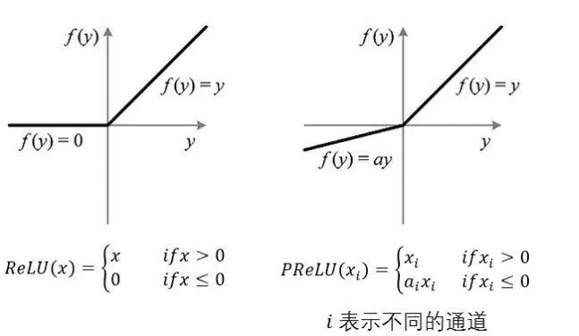

# 深度学习推荐算法之 DIN

原论文 ：**《Deep Interest Network for Click-Through Rate Predction》**

## 1. 模型背景

​		DIN 是阿里巴巴提出来的，该模型基于业务观察，从实际的应用角度进行改进，相比于之前很多 “学术风” 的深度学习模型，该模型更加具有商业气息。该模型的应用场景是阿里巴巴的电商推荐业务，这样的场景下一般会有大量的用户历史行为信息，这个信息是很关键的，因为 DIN 模型的创新点或者说解决的问题就是使用了注意力机制来对用户的兴趣变化动态模拟，而这个模拟过程存在的前提就是用户之前有大量的历史行为了，这样我们在预测用户是否点击某个商品广告时，就可以参考之前他的购买历史或查看过的商品，这样就能猜出用户大致的兴趣来了，这样我们的推荐才能做到更加到位，所以这个模型的使用场景是非常注重用户的历史行为特征（历史购买过的商品或者类别信息），也希望能通过这一点，能够和前面一些深度学习模型比较一下。

​		在个性化的电商推荐业务场景中，也正是由于用户留下了历史交互行为，才能看出之前的深度学习模型（作者统称为 Embedding&MLP 模型）的不足之处。如果学习了前面的各种深度学习模型，就会发现 Embeddin&MLP 模型对于这种推荐任务一般由着差不多的固定处理套路，这就是大量稀疏特征先经过embedding 层，转化为低维稠密的，然后进行拼接，最后喂入到多层神经网络中。

​		这些模型在这种个个性化广告点击任务中是无法表达用户的广泛兴趣的，因为这些模型在得到各个特征的 embedding 之后，就蛮力拼接了，然后就是各种交叉。这时候根本没有考虑之前的用户历史行为商品是什么，究竟用户历史行为中的哪个会对当前的点击预测带来积极的作用。而实际上，对于用户点不点击当前的商品广告，很大程度上依赖于他的历史行为，比如下面一个例子：

​		假设广告中的商品是键盘， 如果用户历史点击的商品中有化妆品， 包包，衣服， 洗面奶等商品， 那么大概率上该用户可能是对键盘不感兴趣的， 而如果用户历史行为中的商品有鼠标， 电脑，iPad，手机等， 那么大概率该用户对键盘是感兴趣的， 而如果用户历史商品中有鼠标， 化妆品， T-shirt和洗面奶， 鼠标这个商品embedding对预测“键盘”广告的点击率的重要程度应该大于后面的那三个。

​		这也就是说，之前的深度学习模型，无法很好地表达用户广泛的兴趣爱好，如果想要表达这些，必须得加大隐向量的维度，让每个特征的信息更加丰富，那这样就带来的问题就是计算量上去了，毕竟真实的情景，尤其是电商广告推荐场景，特征维度的规模是非常大的。并且根据上面的例子，也并不是用户所有的历史行为特征都会对每个商品广告点击预测起到作用。所以对于当前某个商品广告的点击预测任务，没必要考虑之前所有的历史行为。

​		这样 DIN 的动机就出来了，在业务角度，我们应该自适应得去捕捉用户的兴趣变化，这样才能较为准确地实施广告推荐；而放到模型的角度，我们应该考虑到用户的历史行为商品与当前商品广告的一个关联性，如果用户历史商品中很多与当前商品关联，那么说明该商品可能符合用户口味，就该广告推荐给他。而一旦谈到关联性的话，我们就容易想到 “注意力” 的思想了，所以为了更好地从用户的历史行为中学习到与当前商品的关联性，学习到用户的兴趣变化，作者把注意引入到了模型中，设计了一个 “local activation unit” 结构，利用候选商品和历史问题商品之间的相关性计算出权重，这个就代表了用户当前商品广告的预测，用户历史行为的各个商品的重要程度大小，而加入了注意力权重的深度学习网络，这是这次的主角 DNN。

## 2. 模型架构

​		在具体分析DIN模型之前， 我们还得先介绍两块小内容，一个是DIN模型的数据集和特征表示， 一个是上面提到的之前深度学习模型的基线模型， 有了这两个， 再看DIN模型，就感觉是水到渠成了。

#### 2.1 特征表示

​		工业上的CTR预测数据集一般都是`multi-group categorial form`的形式，就是类别型特征最为常见，这种数据集一般长这样：

这里的亮点就是框出来的那个特征，这个包含着丰富的用户兴趣信息。

对于特征编码，作者这里举了个例子：`[weekday=Friday, gender=Female, visited_cate_ids={Bag,Book}, ad_cate_id=Book]`， 这种情况我们知道一般是通过one-hot的形式对其编码， 转成系数的二值特征的形式。但是这里我们会发现一个`visted_cate_ids`， 也就是用户的历史商品列表， 对于某个用户来讲，这个值是个多值型的特征， 而且还要知道这个特征的长度不一样长，也就是用户购买的历史商品个数不一样多，这个显然。这个特征的话，我们一般是用到multi-hot编码，也就是可能不止1个1了，有哪个商品，对应位置就是1， 所以经过编码后的数据长下面这个样子：

这个就是喂入模型的数据格式了，这里还要注意一点 就是上面的特征里面没有任何的交互组合，也就是没有做特征交叉。这个交互信息交给后面的神经网络去学习。

#### 2.2 基线模型

​		这里的base 模型，就是上面提到过的Embedding&MLP的形式， 这个之所以要介绍，就是因为DIN网络的基准也是他，只不过在这个的基础上添加了一个新结构(注意力网络)来学习当前候选广告与用户历史行为特征的相关性，从而动态捕捉用户的兴趣。

基准模型的结构相对比较简单，我们前面也一直用这个基准， 分为三大模块：Embedding layer，Pooling & Concat layer和MLP， 结构如下:

前面的大部分深度模型结构也是遵循着这个范式套路， 简介一下各个模块。

1. **Embedding layer**：这个层的作用是把高维稀疏的输入转成低维稠密向量， 每个离散特征下面都会对应着一个embedding词典， 维度是$D\times K$， 这里的$D$表示的是隐向量的维度， 而$K$表示的是当前离散特征的唯一取值个数,  这里为了好理解，这里举个例子说明，就比如上面的weekday特征：

>  假设某个用户的weekday特征就是周五，化成one-hot编码的时候，就是[0,0,0,0,1,0,0]表示，这里如果再假设隐向量维度是D， 那么这个特征对应的embedding词典是一个$D\times7$的一个矩阵(每一列代表一个embedding，7列正好7个embedding向量，对应周一到周日)，那么该用户这个one-hot向量经过embedding层之后会得到一个$D\times1$的向量，也就是周五对应的那个embedding，怎么算的，其实就是$embedding矩阵* [0,0,0,0,1,0,0]^T$ 。其实也就是直接把embedding矩阵中one-hot向量为1的那个位置的embedding向量拿出来。 这样就得到了稀疏特征的稠密向量了。

​		其他离散特征也是同理，只不过上面那个multi-hot编码的那个，会得到一个embedding向量的列表，因为他开始的那个multi-hot向量不止有一个是1，这样乘以embedding矩阵，就会得到一个列表了。通过这个层，上面的输入特征都可以拿到相应的稠密embedding向量了。

2. **pooling layer and Concat layer**： pooling层的作用是将用户的历史行为embedding这个最终变成一个定长的向量，因为每个用户历史购买的商品数是不一样的， 也就是每个用户multi-hot中1的个数不一致，这样经过embedding层，得到的用户历史行为embedding的个数不一样多，也就是上面的embedding列表$t_i$不一样长， 那么这样的话，每个用户的历史行为特征拼起来就不一样长了。 而后面如果加全连接网络的话，我们知道，他需要定长的特征输入。 所以往往用一个pooling layer先把用户历史行为embedding变成固定长度(统一长度)，所以有了这个公式：

$$
  e_i=pooling(e_{i1}, e_{i2}, ...e_{ik})
$$

​		这里的$e_{ij}$是用户历史行为的那些embedding。$e_i$就变成了定长的向量， 这里的$i$表示第$i$个历史特征组(是历史行为，比如历史的商品id，历史的商品类别id等)， 这里的$k$表示对应历史特种组里面用户购买过的商品数量，也就是历史embedding的数量，看上面图里面的user behaviors系列，就是那个过程了。 Concat layer层的作用就是拼接了，就是把这所有的特征embedding向量，如果再有连续特征的话也算上，从特征维度拼接整合，作为MLP的输入。

3. **MLP**：这个就是普通的全连接，用了学习特征之间的各种交互。

4. **Loss**: 由于这里是点击率预测任务， 二分类的问题，所以这里的损失函数用的负的log对数似然：

$$
L=-\frac{1}{N} \sum_{(\boldsymbol{x}, y) \in \mathcal{S}}(y \log p(\boldsymbol{x})+(1-y) \log (1-p(\boldsymbol{x})))
$$

​		这就是base 模型的全貌， 这里应该能看出这种模型的问题， 通过上面的图也能看出来， 用户的历史行为特征和当前的候选广告特征在全都拼起来给神经网络之前，是一点交互的过程都没有， 而拼起来之后给神经网络，虽然是有了交互了，但是原来的一些信息，比如，每个历史商品的信息会丢失了一部分，因为这个与当前候选广告商品交互的是池化后的历史特征embedding， 这个embedding是综合了所有的历史商品信息， 这个通过我们前面的分析，对于预测当前广告点击率，并不是所有历史商品都有用，综合所有的商品信息反而会增加一些噪声性的信息，可以联想上面举得那个键盘鼠标的例子，如果加上了各种洗面奶，衣服啥的反而会起到反作用。其次就是这样综合起来，已经没法再看出到底用户历史行为中的哪个商品与当前商品比较相关，也就是丢失了历史行为中各个商品对当前预测的重要性程度。最后一点就是如果所有用户浏览过的历史行为商品，最后都通过embedding和pooling转换成了固定长度的embedding，这样会限制模型学习用户的多样化兴趣。

​		那么改进这个问题的思路有哪些呢？  第一个就是加大embedding的维度，增加之前各个商品的表达能力，这样即使综合起来，embedding的表达能力也会加强， 能够蕴涵用户的兴趣信息，但是这个在大规模的真实推荐场景计算量超级大，不可取。 另外一个思路就是**在当前候选广告和用户的历史行为之间引入注意力的机制**，这样在预测当前广告是否点击的时候，让模型更关注于与当前广告相关的那些用户历史产品，也就是说**与当前商品更加相关的历史行为更能促进用户的点击行为**。 作者这里又举了之前的一个例子：

> 想象一下，当一个年轻母亲访问电子商务网站时，她发现展示的新手袋很可爱，就点击它。让我们来分析一下点击行为的驱动力。  展示的广告通过软搜索这位年轻母亲的历史行为，发现她最近曾浏览过类似的商品，如大手提袋和皮包，从而击中了她的相关兴趣

​		第二个思路就是DIN的改进之处了。DIN通过给定一个候选广告，然后去注意与该广告相关的局部兴趣的表示来模拟此过程。 DIN不会通过使用同一向量来表达所有用户的不同兴趣，而是通过考虑历史行为的相关性来自适应地计算用户兴趣的表示向量（对于给的广告）。 该表示向量随不同广告而变化。下面看一下DIN模型。

#### 2.3 DIN 模型架构

​		上完分析完了 base 模型的不足和改进思路之后，DIN 模型的结构也就呼之欲出了，首先，它依然采用了基模型的结构，只不过它是在这个基础上增加了一个注意力机制来学习用户兴趣与当前候选广告的关联程度，用论文中的一句话说就是，引入一个新的的 local cativation unit，这个东西用在了用户历史行为特征这上面，能够根据用户历史行为特征和当前广告的相关性给用户历史行为特征 Embedding 进行加权。下面是其结构：

​		左边是 base model，可以看到的是，各种离散特征的 embedding 向量是简单拼接之后再输入到 MLP 网络中进行高阶特征交叉。而在右边则是 DIN 网络的结构，可以看到，朱主要的改变是用户的 历史行为特征（包括历史购买商品 id 和 历史购买商品的 类别），不再是简答地进行 embeding 之后拼接起来，而是加入了 activatio_unit ,用来学习用户的历史行为特征和商品特征之间的相关性，然后对用户历史行为特征得到的各个 embedding 向量进行加权和得到最终的用户的兴趣向量，我们用 $v_U(A)$ 表示这个向量，那么有如下的计算公式：
$$
v_U(A)=f(v_A,e_1,e_2,...,e_H)=\sum_{j=1}^Ha(e_j,v_A)e_j=\sum_{j=1}^Hw_je_j
$$
​		这里的 $\{v_A,e_1,e_2,...,e_H\}$ 是用户 $U$ 历史行为特征 embedding，$v_A$ 是候选商品 $A$ 的 embedding 向量，$a(e_j,v_A)=w_j$ 表示的权重或者历史行为商品与当前广告 $A$ 的相关性程度，$a(.)$ 表示的是上面那个前馈神经网络，也就是那个所谓的注意力机制。 

​		所以这个篇论文的创新点就是上图中的那个activation unit，传统的 Attention 机制中，给定两个 item embedding，比如 $u$ 和 $v$ ，通常是直接做点积 $u^Tv$ 或者 $u^TWv$，其中的 $W$ 是一个 $|u|\times |v|$ 权重矩阵，但这篇 paper 中阿里做了进一步的改进，首先是将 u 和 v 以及 u、v 的 element wise 差值合并起来作为输入，然后喂给全连接层，最后得出权重，这样的方法损失的信息更少。但其实后来也有该进版本，就是除了上面的三个部分拼接之后，还将 u、v 的 element product 一并拼接到一起作为最终的输入。（可见注意力机制的设计不是一层不变的，可以根据不同的应用场景，采用不同的注意力机制计算方式，当然具体采用哪种方式，还是需要看具体的实验中那种方式的效果最好）

​		再留意以下这个架构中的红线，可以发现，每个 good_id、shop_id 两层属性，shop_id 只跟用户历史中的 shop_id 序列发生作用，good_id 只跟用户历史序列中的 good_id 发生作用，这样做的原因也是显而易见的，因为注意力的重要性应该由同类信息的相关性决定。

​		这里还有一个点需要注意，就是这里权重的加和不是 1，准确地说这里不是权重，而是直接计算地那种分数做为了权重，这个是为了保留用户的兴趣强度。

#### 2.4 其他贡献

​		除了上面的模型贡献，这篇文章还提出了两点在实际工程中非常有用的创新：

- **Mini-batch Aware Regularization**

  ​		考虑有 good_id 特征的大规模神经网络容易过拟合，因此加入正则化是必须的。mini-batch 中只有输入稀疏特征不为 0 对应的参数才更新，但是加入 $L_2$ 正则会导致每个 mini-batch 都会计算全部参数的 $L_2$ 正则，这是不可接受的，所以本文提出了 mini-batch 中 instance 的原始 feature 第 j 维不为 0， 才会计算相应 $w_j$ 的 $L_2-norm$ ，最后近似为至少有一个instance其 j 维不为 0 才计算一次。公式推导如下： 
  $$
  L_2(W)=\sum_{(x,y)\in S}\sum_{j=1}^K\frac{I(x_j\neq 0)}{n_j}||w_j||^2_2\\=\sum_{j=1}^K\sum_{m=1}^B\sum_{(x,y)\in B_m}\frac{I(x_j\neq0)}{n_j}||w_j||^2_2\\\approx\sum_{j=1}^K\sum_{m=1}^B\frac{\alpha_{mj}}{n_j}||w_j||^2_2
  $$
  ​		其中，K 代表 embedding 数目，B 代表 batch 数目，$\alpha_{mj}=\max_{(x,y)\in B_m}I(x_j\neq0)$ 代表在第m个 mini-batch 中是否至少有一个样本其第 j 个特征不为 0。（也就是取值或者为 0，或者为 1，此处的假设应该是出于对样本稀疏性的假设，就是在 mini-batch 的多个样本中，即使有特征出现，其重复出现的次数也比较少，所有采用了这样的近似方法来）。

  ​		所有有了上式之后，loss 的形式就定了，因此参数更新公式如下：
  $$
  w_j\leftarrow\eta(\frac{1}{|B_m|}\sum_{(x,y)\in B_m}\frac{\partial L(p(x),y)}{\partial w_j}+\lambda\frac{\alpha_{mj}}{n_j}w_j)
  $$

- **Data Adaptive Activation Function**

  ​		作者对传统的激活函数 ReLU 作出了改进，提出了 Dice 函数，过程如下：

  - ReLU 和 PReLU：

    

    上图中，左边是 ReLU 激活函数，其值在大于 0 的时候，原样输出，小于 0 时输出 0。这样就可以有效避免梯度消失问题，但是同时也会导致很多模型参数更新缓慢。右边是 PReLU 激活函数，唯一的区别在于，在小于 0 的时候，梯度依然存在，网络的参数依然可以更新，于是加快了网络的收敛速度。

  - PReLU 和 Dice：

    尽管对 ReLU 进行了修正得到了 PReLU，但是仍然有一个问题，即：我们认为分割点是 0，但实际上，分割点应该由数据决定。因此论文中提出了 Dice 激活函数， Dice 激活函数的全称是 Data Dependent Activation Function，其形式如下所示：

    PReLU函数可以表示为：
    $$
    f(s)=p(s).s+(1-p(s)).\alpha s
    $$
    ​		其中的 $p(s)$ 为指示函数，即：$p(s)=I(s>0)$，指示函数以 0 为分界点，进行划分，但是这在每一层的输入分布发生变化时可能并不适用，所以论文对函数进行了改进，提出了如下的指示函数：
    $$
    p(s)=\frac{1}{1+exp(-\frac{s-E(s)}{\sqrt{Var(s)+\epsilon}})}
    $$
    ​		下面分别画出了 PReLU 的指示函数和 Dice 的指示函数变化情况：

    

    ​		可以看到上面的改进，主要体现在两个方面，一方面是平滑了激活函数在分界点附近的曲线，另一个方面激活函数会根据每层输入的数据分布来自适应调整分界点的位置，从而对模型参数的更新和收敛加速起到一定的作用（是否可以借鉴到其他使用 PReLU 激活函数的地方呢？可以尝试一下）。

## 3. 模型总结

​		DIN 是在工业界应用比较广泛的模型，而这篇论文也是十分优秀经典的论文。主要有以下几个方面：

- 工程性很强。工程性很强的文章首先是便于实现，其次是可以从字里行间看到许多实践出真知的影子，比如 DIN 这篇文章中，使用 GAUC 这样的metric的改进，以及 Dice 这样的激活函数的创新，都是对经典知识在实践中进行改进的例子。

- 对用户行为的观察非常精准；有句话说做推荐就是 “揣摩人心”，你把用户的行为和习惯揣摩了，才能以此出发，从技术上映射用户的习惯。 DIN 这篇文章有效地利用了用户兴趣多性以及当前候选商品仅与用户的一部分想去有关这一特点，引入了注意力机制，这是非常精准的动机；

- 模型的微创新，这片文章把 NLP 中大行骑到的 注意力机制引入了推荐领域，当然是典型并且有效的创新手段，也是所有算法工程师应该学习的地方。

  

## 4. 思考

DIN模型在工业上的应用还是比较广泛的， 大家可以自由去通过查资料看一下具体实践当中这个模型是怎么用的？ 有什么问题？

比如行为序列的制作是否合理， 如果时间间隔比较长的话应不应该分一下段？ 

再比如注意力机制那里能不能改成别的计算注意力的方式会好点？(我们也知道注意力机制的方式可不仅DNN这一种)

再比如注意力权重那里该不该加softmax？ 

 这些其实都是可以值的思考探索的一些问题，根据实际的业务场景，大家也可以总结一些更加有意思的工业上应用该模型的技巧和tricks，欢迎一块讨论和分享。

​		