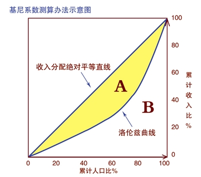

# 推荐系统概述

## 1.什么是推荐系统

​		随着信息技术和互联网的发展，人们从信息匮乏时代走进了信息过载的时代。作为信息消费者，如何从大量信息中找到自己感兴趣的信息是一件十分重要而困难的事情；作为信息生产者，如何让自己的信息脱颖而出，同样是一件重要而有难度的事情。推荐系统就是联系用户和信息的，一方面帮助用户发现对自己有价值的信息，另一方面让信息展现在对它感兴趣的用户面前。

​		搜索引擎是一种解决信息过载问题的方案，但是和搜索引擎不同的是，推荐系统不需要用户提供明确的需求，而是通过分析用户的历史行为给用户兴趣建模，主动给用户推荐能够满足他们兴趣的产品。

​		推荐算法的本质是通过一定的方式将用户和物品联系起来，而不同的推荐系统采用不同的方式。

## 1.2 个性化推荐系统的应用

​		和搜索引擎不同，个性化推荐系统需要依赖用户的行为数据，因此一般都是作为一个应用存在于不同的网站之中。各种网站中都以看到推荐系统的应用，个性化推荐系统在这些网站中的作用是通过分析大量用户行为日志，给不同用户提供不同的个性化页面显示，以此来提高网站的点击率和转化率。广泛应用的领域包括：电子商务、电影和视频、音乐、社交网络、阅读、基于位置的服务、个性化邮件和广告等。

​		虽然不同的网站使用不同的推荐技术，但是几乎所有的推荐系统都是由前台的展示页面、后台的日志系统以及推荐算法3部分构成。

## 1.3 推荐系统的评测

​		一个完整的推荐系统包括3个参与方，用户、物品提供者和提供推荐系统的网站。

​		好的推荐系统不仅仅能够准确预测用户的行为，而且能够拓展用户的视野，帮助用户发现那些他们可能会感兴趣，但是却不那么容易发现的东西。同时推荐系统还要能够帮助商家将那些埋没在长尾中的商品介绍给可能对它们感性趣的用户。

#### 1.3.1 推荐系统实验方法

1. **离线实验：**

   离线实验的一般步骤为：

   - 通过日志系统获得用户行为数据，并按照一定的格式生成一个标注数据集；
   - 将数据集按照一定的规则分成训练集和测试集；
   - 在训练集上训练用户的兴趣模型，在测试集上进行预测；
   - 通过事先定义的离线指标评测算法在测试集上的预测效果；

   ***优点：***

   - 不需要对实际系统的控制权；
   - 不需要用户参与实验；
   - 速度快，可以测试大量算法；

   ***缺点：***

   - 无法计算商业上关心的指标；
   - 离线实验的指标和商业指标存在差距；

   

2. **用户调查：**

   ​        用户测试需要一些真实的用户，让他们在需要测试的推荐系统上完成一些任务。在他们完成任务时，我们需要观察和记录他们的行为，并让他们回答一些问题。最后我们需要通过分析他们的行为和答案了解测试的系统的性能。

   ​		用户调查是推荐系统评测的一个重要工具，很多离线无法评测的与用户主观感受有关的指标都可以通过用户调查获得。用户调查测试用户不是随机的，需要保证测试用户的分布和真实用户分布相同，比如男女各半，以及年龄、活跃度的分布都和真实用户分布尽量相同。此外，用户调查尽量保证是双盲的。

   ***优点：***

   ​		可以获得很多体现用户主观感受的指标，相对在线实验风险很低，出错后容易弥补；

   ***缺点：***

   ​		招募测试用户代价较大，很难组织大规模测试用户，因此会使测试结果的统计意义不足。 

   

3.  **在线实验：**

   ​		AB测试是很常用的在线评测算办法的实验方法，它通过一定的规则将用户分为不用组，并且对不同的组采用不同的算法，然后统计分析不同组用户的各种不同评测指标比较不同的算法。

   ​		AB测试一般不会用于所有算法测试，只会用于那些在离线实验和用户调查中表现很好的算法。流量的切分也是AB测试中的关键问题。

   ***优点：***

   ​		可以公平获得不同算法的实际在线时的性能指标，包括商业上关注的指标；

   ***缺点：***

   ​		周期比价长，必须进行长期的实验才能获得可靠的结果。

​		一般来说，一个新的推荐算法最终上线，需要完成上面所说的3个实验。

- 首先，需要通过离线实验证明它在很多指标上优于现有算法；
- 然后，需要通过用户调查确定它的用户满意度不低于现有算法；
- 最后，通过在线AB测试确定它在我们关心的指标上优于现有的算法；

#### 1.3.2 评测指标：

**1. 用户满意度：**

​		用户满意度只能通过用户调查或在线实验获得；

​		用户满意度调查主要通过调查问卷的形式；

​		在在线系统中，用户满意度主要通过一些对用户行为的统计得到；

**2. 预测准确度：**

​		预测准确度度量一个推荐系统或推荐算法预测用户行为的能力，这个指标是重要的推荐系统离线评测指标，从推荐系统诞生之日起，几乎99%与推荐相关的论文都在讨论这个指标。这个指标能通过离线实验计算，方便了很多学术界研究人员研究推荐算法。

​		离线的推荐算法与不用的研究方向，下面针对一些不同的研究方向介绍他们的预测准确度指标。

- **评分预测**

  ​		如果知道了用户对物品的历史评分，就可以从中学习到用户的兴趣模型，并预测用户在将来看到一个他没有评分过的物品时，会给这个物品多少分。这种行为称为评分预测。

  ​		评分预测准确度一般通过均方根误差$RMSE$或者平均绝对误差$MAE$计算。对于测试集中的一个用户$u$和物品 $i$ ，令用户实际评分为 $r_{ui}$ ,而预测评分为 $\hat{r_{ui}}$ ，则：
  $$
  RMSE=\frac{\sqrt{\sum_{u,i\in T}(r_{ui}-\hat{r_{ui}})^2}}{|T|}
  $$

  $$
  MAE=\frac{\sum_{u,i\in T}|r_{ui}-\hat{r_{ui}}|}{|T|}
  $$

  ​		$RMSE$加大了对预测不准的用户物品评分惩罚，因而对系统的评分更加苛刻。

- **TopN推荐**

  ​		网络在提供服务的时候，一般给用户一个个性化的推荐列表，这种推荐叫做$TopN$推荐。这种推荐一般通过准确率和召回率度量；

  ​		设$R(u)$是根据用户在训练集上的行为给用户作出的推荐列表，而$T(u)$是用户在测试集上的行为列表，则：
  $$
  Recall=\frac{\sum_{u\in U}|R(u)\cap T(u)|}{\sum_{u\in U}|T(u)|}
  $$
  
  $$
  Precision=\frac{\sum_{u\in U}|R(u)\cap T(u)|}{\sum_{u\in U}|R(u)|}
  $$

**3.  覆盖率：**

​		覆盖率描述一个推荐系统对物品长尾的发掘能力。

​		最简单的定义为推荐系统能够推荐的物品占总物品集合的比例，设系统用户集合为$U$，推荐系统给每个用户推荐一个长度为$N$的物品列表$R(u)$，那么推荐系统的覆盖率可以定义为：
$$
Coverage=\frac{|\cup_{u \in U}R(u)|}{|I|}
$$
​		可见基于热门排行榜的推荐覆盖率较低，一个好的推荐系统不仅需要较高的用户满意度，还需要较高的覆盖率。但是上面的定义过于粗糙，覆盖率很高的系统可以有无数的物品流行度分布，为了更细致描述系统发掘长尾分布的能力，需要统计推荐列表中不同物品出现次数的分布。如果所有物品都出现在推荐列表中，且出现的次数差不多，那么推荐系统发掘长尾的能力就越好。因此可以通过研究物品在推荐系统出现次数的分布来描述推荐系统挖掘长尾的能力。可以采用信息学中的两个很重要的指标：

​		***信息熵：***
$$
H=-\sum_{i=1}^np(i)log\ p(i)
$$
​				此处$p(1)$是物品 $i$ 的流行度除以所有物品流行度之和。

​		***基尼系数：***
$$
G=\frac{1}{n-1}\sum_{j=1}^{n}(2j-n-1)p(i_j)
$$
​				其中，$i_j$ 是按照物品流行度$p()$ 从小到大排序物品的物品列表中第j个物品。

​				关于基尼指数的解释，可以参见下图：

​				基尼系数可以用来描述贫富差距，也就是图中$S_A/(S_A+S_B)$，把物品流行度按照下面类似的方式作出

​		计算出的$S_A/(S_A+S_B)$，就是上式子(7)所描述的内容。

**4. 多样性：**

​		用户的兴趣是广泛的，为了满足用户广泛的兴趣，推荐列表需要能够覆盖用户不同的兴趣领域，即推荐结果具有多样性。

​		多样性描述了推荐列表中两两物品之间的不想似性。多向性和相似性是对应的。假设$s(i,j)\in [0,1]$定义了物品$i$ 和 $j$ 之间的相似性，那么用户 $u$ 的推荐列表 $R(u)$ 的多样性定义为：
$$
Diversity=1-\frac{\sum_{i,j \in R(u) ,i\not j}s(i,j)}{\frac{1}{2}|R(u)|(|R(u)|-1)}
$$
 		而推荐系统的多样性可以定义为所有用户推荐列表多样性的平均值：
$$
Diversity=\frac{1}{|U|}\sum_{u\in U}Diversity(R(u))
$$
​		上面的定义中，不同的相似度度量函数能得到不同的多样性定义。

**5. 新颖性：**

​		新颖的推荐指的是推荐系统推荐给用户那些他么之前没有听说过的物品，评价新颖性的最简单的方式就是利用推荐结果的平均流行度，因为越是不热门的物品可能越让用户觉得新颖。因此，推荐结果中物品的平均热门程度较低，那么推荐结果可能就有比较高的新颖性。

​		但是这种方式比较粗略，因为不同用户不知道的东西是不同的，因此，要准确计算新颖性需要做用户调查。通过牺牲精度来提高多样性和新颖性很容易，而困难在于如何在不牺牲精度的情况下提高多样性和新颖性。 

**6. 惊喜度：**

​		如果推荐系统的结果和用户的历史兴趣不相似，但是却让用户觉得满意，那么就可以说推荐系统的惊喜度很高，而推荐的新颖性只取决于用你固话是否听说过这个推荐结果。

​		目前并没有什么公认的惊喜度指标定义方式，只有一些定性地度量。提高推荐结果的的惊喜度需要提高推荐结果的用户满意度，同时降低推荐结果和用户历史兴趣的相似度。

**7. 信任度：**

​		对于机器学习的推荐系统，存在信任度的问题，如果用户信任推荐系统，那就会增加用户和推荐系统的交互。信任度只能通过问卷调查的方式来度量。

​		提高推荐系统的信任度，可以通过两种方式：首先是增加推荐系统的透明度，而增加系统的透明度的主要办法是提供推荐解释。只有让用户认同推荐系统的运行机制，才会提高用户对推荐系统的信任度。其次是考虑用户的社交信息，利用用户的好友信息给用户做推荐，并且用好友进行推荐解释。

**8. 实时性：**

​		推荐系统的实时性包括两个方面的内容；

​		首先，推荐系统需要实时地更新推荐列表来满足用户新的行为变化。很多推荐系统会在离线状态每天计算一次用户推荐列表，然后在线期间将推荐列表展示给用户。这种设计心显然无法满足实时性。与用户行为相应的实时性，可以通过推荐列表的变化率来评测。如果推荐列表在用户有行为前后变化不大，或者没有变化，那么说明推荐系统实时性不高。

​		其次，推荐系统需要能够将新加入系统的物品推荐给用户，这主要考验推荐系统的冷启动能力。而对于新物品的推荐能力，可以利用用户推荐列表中有多大比例的物品是当天新加入的来评测。

**9. 健壮性：**

​		健壮性指标衡量一个系统抗击作弊的能力。算法健壮性的评测主要利用模拟攻击。首先，给定一个数据集和一个算法，可以用这个算法给这个数据集中的用户生成推荐列表。然后，用常用的攻击方法往数据集中注入噪声数据，之后再利用相同的算法在有噪声的数据上再次生成用户推荐列表。最后，通过比较攻击前后推荐列表的相似性来评测算法的健壮性。

**10. 商业目标：**

​		很多时候，网站评测推荐系统更加注重网站的商业目标是否达成，商业目标个网站的盈利模式是息息相关的，因此，设计推荐系统需要考虑最终的商业目标，而网站使用使用推荐系统的目的除了满足用户发现内容的需求，也需要利用推荐系统加快实现商业上的指标。

#### 1.3.3 评测维度

​		上面提到了很多评测指标，但是评测推荐系统只能还需要考虑评测维度，比如一个推荐算法，虽然整体上性能不好，但是在某种情况下性能比较好，而增加评测维度的目的是知道一个算法在什么情况下表现性能最好。这样可以为融合不同的推荐算法取得最好的整体性能带来参与。

- ***用户维度：***主要包括用户的人口统计学信息、活跃度以及是不是新用户等；

- ***物品维度：***包括物品的属性信息、流行度、平均分以及是不是新加入的物品等；

- ***时间维度：***包括季节，是工作日还是周末，是白天还是晚上等。

  

  

