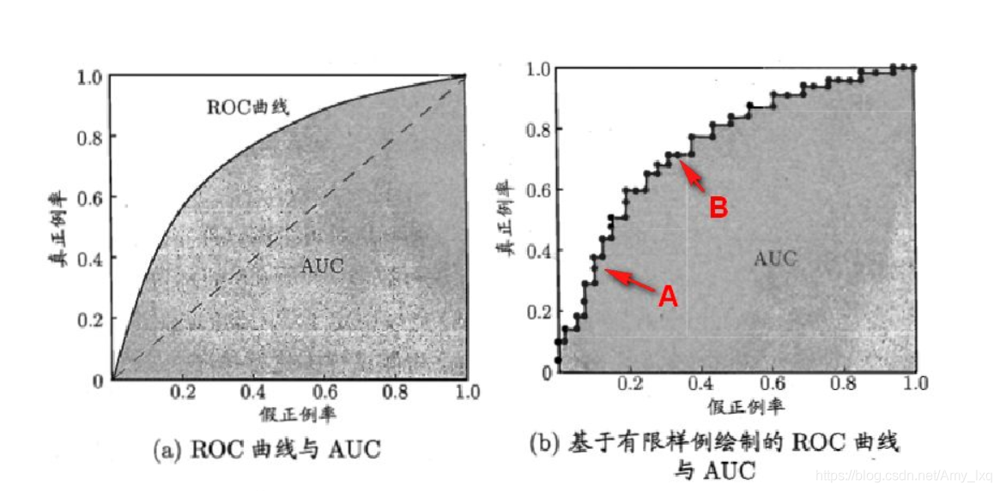

# 推荐系统评测

​		在实际应用场景中，有许多不同的评价指标可以用来评估推荐系统在不同方面的性能，包括总体销售量、特定商品销量提升、点击率、平台活跃度、顾客回头率、顾客满意度、顾客忠诚度等。这些评价指标有些可以定量计算，有些只能定性描述；有些可以通过离线实验计算，有些则必须通过用户调查或者，还有一些㤇在线评测或得。

## 1.评测视角

​		从不同参与方的角度，需要构建不同的评价方法和评价指标。

​		从用户的角度，一个好的推荐系统应该能够降低其获取信息的成本，并且应该优先从“长尾”区域选择项目进行推荐，即推荐用户可能喜欢，但是又不为大多数人所知的项目；

​		从商家或者平台的角度，一个优秀的推荐系统应该能够增加 用户点击率、用户转化率、平台活跃度等，即能够为平台或商家带来收益或者利润。

​		从算法研究人员的角度，一个好的推荐系统能够准确预测用户对项目的偏好程度，并且在某些评价指标上表现得比现有系统更好。

## 2. 实验方法

​		在线实验、用户调查、离线实验；

## 3. 评分预测评价指标

#### 3.1 $MAE$ 、 $MSE$、$RMSE$

​		**平均绝对误差MAE**：表示预测值与实际观测值之间绝对误差的平均值。可以很好地反映预测误差的实际情况，但由于不可导，难以直接进行优化；
$$
MAE=\frac{1}{|T|}\sum_{(u,i)\in T}|\hat r_{ui}-r_{ui}|
$$
​		 **平均平方误差MSE：**表示预测值与实际观测值之间误差的平方和的均值，简称均方误差。$MSE$ 虽然便于计算和使用，但是其所得结果和原度量（评分）的范围（量纲）不同，所以不便于人工判断。
$$
MSE=\frac{1}{|T|}\sum_{(u,i)\in T}(\hat r_{ui}-r_{ui})^2
$$
​		**均方根误差：**是均方误差的算术平方根，用来衡量预测值与实际值之间的偏差，又称为标准误差。$RMSE$ 的结果和原度量的范围相同，相比于 $MSE$ 更便于人工判断。
$$
RMSE=\sqrt{\frac{1}{|T|}\sum_{(u,i)\in T}(\hat r_{ui}-r_{ui})^2}
$$

#### 3.3 $NMAE$ 和 $NRMSE$ 

​		虽然 $MAE$ 和 $RMSE$ 的结果和原度量的范围相同，但是当多个问题（或数据集）的评分范围不同时，也难以用其来比较不同算法的性能。为了解决这一问题，采用标准绝对误差（$NMAE$）和标准均方误差（$NRMSE$），他们是根据评分范围（$[r_{min},r_{max}]$）对 $MAE$ 和 $RMSE$ 进行归一化的版本。
$$
NMAE=\frac{MAE}{r_{max}-r_{min}}\\RMSE=\frac{RMSE}{r_{max}-r_{min}}
$$
​		

## 4. Top-N 推荐评价指标

​		$Top-N$ 推荐的目标是推荐列表中能够包含尽可能多的用户感兴趣项目，并且这些项目的排名尽可能靠前。对应的评价指标通常采用一些分类准确度指标或是一些基于排序的指标，如：精确度、召回率、$AUC$、$ROC$、$MAP$、$nDCG$等。

#### 4.1 分类准确度指标

​		如果将被推荐的 $Top-N$ 项目看作是被预测为正样本，其他样本看作是被预测为负样本，则可以采用分类准确度评价指标衡量算法的优劣。

​		**精确度：**对于具体的一个用户而言，精确度 
$$
Precision(u)=\frac{|R(u)\cap T(u)|}{|R(u)|}=\frac{TP}{TP+FP}
$$
​				对于整个系统，精确度为：
$$
Precision=\frac{\sum_{u\in U}Precision(u)}{|U|}
$$
​				精确度反映的是系统对负样本的识别能力，因为精确度高要求 $FP$ 较低。

​		**召回率：**对于具体一个用户而言，召回率：
$$
Recall(u)=\frac{|R(u)\cap T(u)|}{|T(u)|}=\frac{TP}{TP+FN}
$$
​				对于整个系统，召回率为：
$$
Recall=\frac{\sum_{u\in U}Recall(u)}{|U|}
$$
​				召回率反映的是系统对正样本的识别能力。

​		

​		尽管从公式中看，两个指没有必然的关系，但是在大规模问题中，两个指标确是相互制约的，一般来说，准确率高时，则系统偏向于只识别最优把握的正样本，但是这难免会漏掉不少正样本，导致召回率低；而当召回率较高时，则系统偏向于降低阈值，增加识别为正样本的数量，这样会导致更多的 $FP$，准确率会降低。

​		**P-R 曲线: ​** 通过调整分类的概率阈值（大于阈值被认为是正样本），可以得到不同的 $P-R$ 值，从而得到一条曲线，通常纵坐标为 $P$，横坐标为 $R$。通常随着则分类的阈值从大到小变化，召回率会升高，而准确率会降低。当比较两个分类器好坏时，$P-R$ 曲线越靠近坐标 $(1,1)$ 越好。$P-R$ 曲线能够直观地显示推荐算法在整体样本上的召回率和准确率。在进行算法性能比较时，若一个算法的 $P-R$ 曲线完全被另一个算法的 $P-R$ 曲线包住，则可以断言后者的性能优于前者。

​		

​		**F1值：**一种更为容易计算的常用的综合评价指标，定义为：
$$
F1=\frac{2\times Recall\times Precision}{Recall+Precision}
$$
​		

​		**F值：**相比于 $F1$ 值，允许对精确度和召回率设置不同的偏好，定义为：
$$
F=\frac{(1+\beta^2)\times Precision\times Recall}{(\beta^2\times Precision)+Recall}
$$
​					当 $\beta=1$ 时，退化为 $F1$ 值；当 $\beta>1$ 时，召回率影响更大；当 $\beta<1$ 时，准确率影响更大。

#### 4.2 ROC 曲线和 AUC值

​		$P-R$ 曲线容易受到正负样本比率变化的影响，当正负样本分布变化时，$P-R$ 曲线的形状可能发生剧烈的变化（比如单纯增加负样本，在互联网环境下，这是一种常见的场景，根据公式，随着负样本数目的增加，我们假设新增的负样本和原来的负样本是独立同分布的，那么当模型相同时，$FP$ 和 $TN$ 都会增加，于是 $Recall$ 值虽然理论上不会变化，但是 $Precision$ 会降低）。针对这一情况，实际中常常会采用 $ROC$ 曲线代替。并且用 $ROC$ 曲线下的面积来度量推荐算法的性能。

​		**$ROC$ 曲线** 全程受试者工作特征曲线，又称为感受性曲线。和 $P-R$ 曲线类似，根据推荐算法预测的概率值或者置信度，从大到小对样本进行排序，并按此逐个改变预测的阈值，每次计算两个指标 真阳性率 和 假阳性率，分别以它们为纵坐标和横坐标进行作图，就得到了 $ROC$ 曲线。

​		真阳性率 $TPR$ ，表示所有真正的真样本，被正确识别的比率，计算公式与召回率相同，如下：
$$
TPR=\frac{TP}{TP+FN}
$$
​		假阳性率 $FPR$，表示所有真正的负样本中，被错误识别为正样本的比率，计算公式为：
$$
FPR=\frac{FP}{FP+TN}
$$
​		根据上面的计算公式可以知道，即使增加负样本数（或者正样本数），只要增加的负样本（或正样本）和原来的负样本（或正样本）是独立同分布的，那么 $TPR$ 值 和 $FPR$ 值 就不会受到影响。因此 $ROC$ 曲线更是比 $P-R$ 曲线更适合用来表示推荐算法的综合性能。

​		下面是一个 $ROC$ 曲线的例子：

​		当阈值从大到小逐渐变化时，可以想象，当阈值很大时，$TP$ 和 $FP$ 都趋于 0，也就是所有的样本都被分类为负样本，此时 $TPR$ 和 $FPR$ 都为趋近于 0 ，当 阈值逐渐减小时，$TP$ 和 $FP$ 都逐渐增大，而 $FN$ 和 $TN$ 都减小，$TPR$ 和 $FPR$ 都增大；当阈值很小时，几乎所有的样本都被识别为正样本，此时 $TPR$ 和 $FPR$ 都趋近于 1 。

​		**$AUC$ 值：** $ROC$ 曲线下的面积，就是 $AUC$ 值，这个数值一般的范围为: $[0.5\ ,\ 1]$。其本质上是一个概率值，假设推荐算法的输出是样本的正例 $Score$（置信度），那么 $AUC$ 值的物理意义就是任意取一对（正、负）样本，正样本的 $Score$ 大于负样本 $Score$ 的概率。$AUC$ 值越大，表示当前推荐算法越有可能将正样本排在负样本的前面，推荐效果越好。

​		虽然可将 $ROC$ 曲线夏敏的面积拆分为一个个小的梯形面积之和，但是一般更为常用的 $AUC$ 值的计算方法如下（假设 $M$ 个正样本，$N$ 个负样本）：

- 把所有样本的样本按照 $Score$ 排序，依次用 $Rank$ 表示它们。例如，$Score$ 最大的样本表示为 $Rank=n（n=M+N）$，其次为 $n-1,...$，$Score$ 最小的样本 $Rank=1$ 。
- 把所有正样本的 $Rank$ 相加，得到所有可能的样本对中，正样本 $Score$ 更大的样本对数：$\sum_{i\in positive}Rank_i$。
- 减去两个正样本对的数目：$\frac{M(M+1)}{2}$ ，得到所有可能的正负样本对中，正样本数排在前面的样本对数：$\sum_{i\in positive}Rank_i-\frac{M(M+1)}{2}$。
- 通过除以所有可能的正负样本对数得到 $AUC$ 值：

$$
AUC=\frac{\sum_{i\in positive}Rank_i-\frac{M(M+1)}{2}}{M\times N}
$$

#### 4.3 基于排序的评价指标

​		精确度值考虑了推荐列表中被正确推荐的项目数，但是没有考虑项目之间的顺序关系或整体排序。推荐系统返回的结果（推荐列表）通常是有序的，相关项目排的越靠前越好。

​		**平均精确度（AP）：** 是一种能够反映推荐列表相关项目排序位置的指标，被定义为在不同召回率点上精确度的平均值。（意思是在召回率相同的基础上再考考虑用该指标进一步细化衡量不同算法的性能），对于用户 $u$ 的推荐列表，其平均精确度为：
$$
AP(u)=\frac{1}{r}\sum_{i=1}^r\frac{i}{pos(i)}
$$
​		式中，$r$ 表示推荐列表中，用户 $u$ 有过正反馈的项目的数量，$pos(i)$ 表示第 $i$ 个正样本的位置，显然有 $pos(i)\geq i$。

​		**平均精确度均值（MAP）：** 针对所有用户的性能度量指标。$MAP$ 也就是对所有用户的 $AP$ 值求平均。
$$
MAP=\frac{1}{|U|}\sum_{u\in U}AP(u)
$$

​		对于推荐列表中的每个项目 $i$ ，都有一个相关度评分值 $rel_i>0$，称之为 增益；

​		**累计增益（GG）：**所有项目的增益相加所得；
$$
GG(u)=\sum_{i=1}^{|L_u|}rel_i
$$
​		**折损累积增益（DGG）：**在  $$GG$$ 的基础上引入位置影响因子：
$$
DGG(u)=rel_1+\sum_{i=2}^{|L_u|}\frac{rel_i}{\log_2i}
$$
​		很好证明当项目给定式增益越大的项目排得越靠前，$DGG$ 的值越大。

​		**归一化折损累积增益：**因为不同用户的 $DGG$ 取值差别很大，所以虽然同样是衡量推荐系统针对一个用户的性能，但是 $DGG$ 确不能像 $AP$ 一样，直接横向比较。于是，需要做归一化处理，$IDGG$ 表示推荐列表按照相关度从高到低排序后得到的 $DGG$ 值（业就是当推荐列表中项目确定之后，改变排序方式所能达到的最大的 $DGG$ 值），则：
$$
nDGG(u)=\frac{DGG(u)}{IDGG(u)}
$$
​		整个系统的 $nDGG$ 可以通过取平均得到：
$$
nDGG=\frac{1}{|U|}\sum_{u\in U}nDGG(u)
$$

#### 4.4 常用的其他评价指标

​		**多样性：**因为在某些情况下，提供一系列的相似的项目可能对用户用处不大；多样性体现在两个层面：一是个体多样性，也叫用户内的相似性，衡量推荐系统为一个用户推荐的项目的多样性；二是整体多样性，也叫用户间多样性，衡量推荐系统为不用用户推荐不同项目的能力。

​		$L(u)$ 表示用 $u$ 的推荐列表，$similarity(i,j)$ 表示项目之间的相似度，那么用户多样性可以表示为：
$$
IntraListDiversity(L_u)=1-\frac{2\times \sum_{i,j\in L_u,i\neq j}similarity(i,j)}{|L_u|\times(|L_u|-1)}
$$
​		对所有用户的个体水平多样性可以通过取平均求得：
$$
IntraListDiversity=\frac{1}{|U|}\sum_{u\in U}IntraListDiversity(L_u)
$$
​		整体多样性可以通过对不同用户推荐列表的重叠度来计算：
$$
InterDiversity=1-\frac{2}{|U|(|U|-1)}\sum_{u,v\in U,u\neq v}\frac{|L_u\cap L_v|}{|L_u\cup L_v|}
$$

​		**新颖性：**指的是推荐系统向用户推荐非热门、非流行项目的能力。针对某一个用户 $u$ ，推荐列表 $L_u$ 的新颖性为：
$$
Novelty(L_u)=1-\frac{\sum_{i\in L_u}p(i)}{|L_u|}
$$
​				其中，$p(i)$ 表示项目 $i$ 的流行度；整个系统的新颖性可以取平均获得：
$$
Novelty=\frac{1}{|U|}\sum_{u\in U}Novelty(L_u)
$$
​		

​		**覆盖率：**覆盖率表示推荐系统所能推荐的项目占所有项目的比例（其中 $I$ 为整个项目集合）：
$$
Coverage=\frac{\cup_{u\in U}L_u}{|I|}
$$
