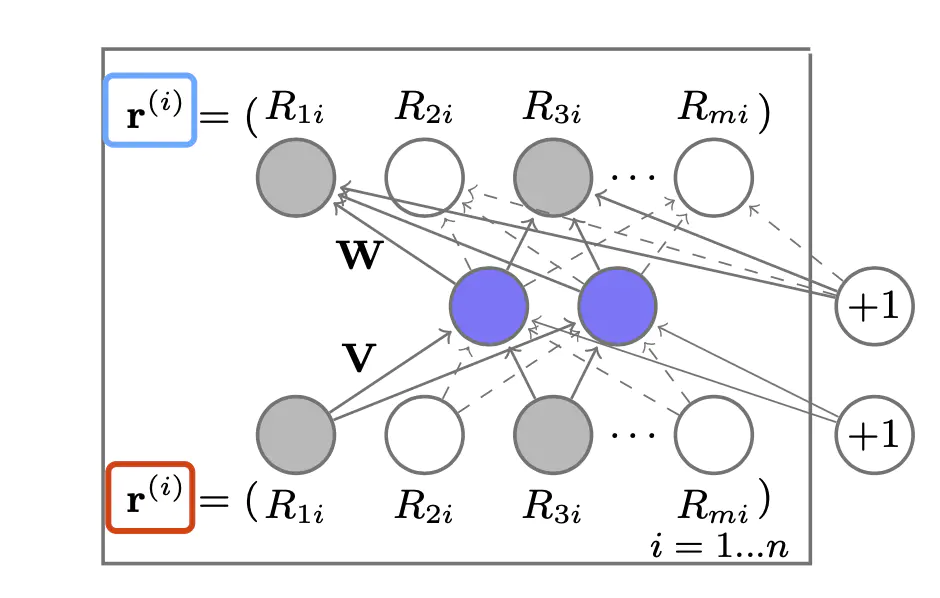

## 深度学习算法之 AutoRec

原论文**《AutoRec: Auto Encoder Meet Collaborative Filtering》**

### 1. 模型简介

​		AutoRec 将自编码器的思想和协同过滤的思想结合，提出了单隐藏层的简单神经网络推荐模型，拉开了使用深度学习解决推荐系统问题的序幕，为复杂的深度学网络的构建提供了思路。

​		AutoRec 模型是一个标准的自编码器，它的基本原理是利用协同过滤中的共现矩阵，完成物品向量或者用户向量的自编码。在利用自编码的结果得到用户对物品的预估评分，进而进行推荐排序。

​		经过自编码器生成的输出向量，由于经过了自编码器的 “泛化” 过程，不会完全等同于输入向量，也因此具备了一定的缺失维度的预测能力，这也是自编码器能用户推荐系统的原因。

​                                

### 2. 模型细节

​		我们考虑在评分预测任务中叙述自编码器的应用。

​		假设有 m 个用户，n 个物品，用户会对 n 个物品中的一个或几个评分，未评分的值可以用默认值或者平均值，则所有的 m 个用户对 n 个物品的评分可以形成一个 $m\times n$ 矩阵，这就是协同过滤中的共现矩阵。

​		对于一个物品 $i$ 来说，所有 $m$ 个用户对它的评分可以形成一个 $m$ 维的向量，$r^{(i)}=(R_{1i},R_{2i},...,R_{mi})^T$，AutoRec 的想法就是希望通过自编码器的编码和重建，使得该重建函数生成的评分向量与原评分向量之间的评分误差最小。

​		通过输入的向量不同，可以分为基于物品的 AutoRec 和 基于用户的 AutoRec。我们以 基于物品的 AutoRec为例。

#### 2.1 模型计算过程

​		下面是 AutoRec的整体框架图：

 

​		可以看到整个模型只有3层，蓝色的圆点代表的是隐层神经元，红色方框代表的是模型的输入%7D)，经过权重矩阵到达隐藏层，再经过权重矩阵到达输出层，我们的目的是通过训练模型，找到合适的权重矩阵和，以及偏置和，使得输入值和输出值的误差最小。
 令模型的重建函数为)，其中，其定义如下：

## 2.2 损失函数

首先给出自编码器的损失函数，如下：

 其中是维向量的集合。

AutoRec模型的损失函数中考虑到了对参数的限制，因此加入了L2正则来防止过拟合，损失函数变化为：

 其中 为Frobenius范数。
 定义好损失函数之后，就可以使用反向传播和梯度下降等方法来进行模型训练了。基于物品的AutoRec模型的训练过程如下：

1. 输入物品的评分向量%7D)，即所有用户对物品的评分向量。
2. 得到模型的评分预测输出向量%7D%3B%20%5Ctheta))。
3. 根据评分预测向量和真实评分向量的误差进行训练，最小化损失函数，得到最终的模型参数。

### 3. 模型特点

​		AutoRec模型从神经网络的角度出发，使用一个单隐藏层 AutoRec 泛化用户或者物品评分，使得模型具有一定的泛化和表达能力。但是由于 AutoRec 模型的结构比较简单，使得其存在一定的表达能力不足的问题。

​		从深度学习的角度来说，AutoRec模型的提出，拉开了深度学习的思想解决推荐问题的序幕，为复杂深度学习网络的构建提供了思路。

