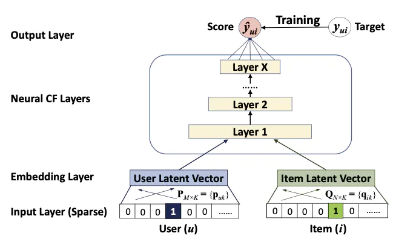
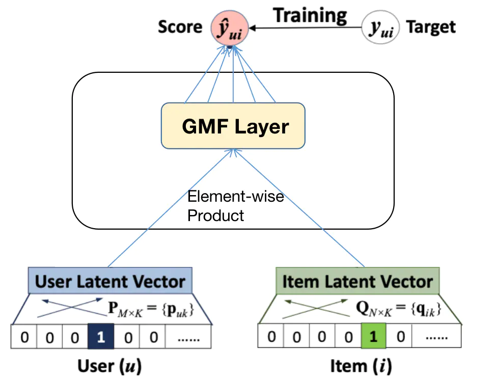
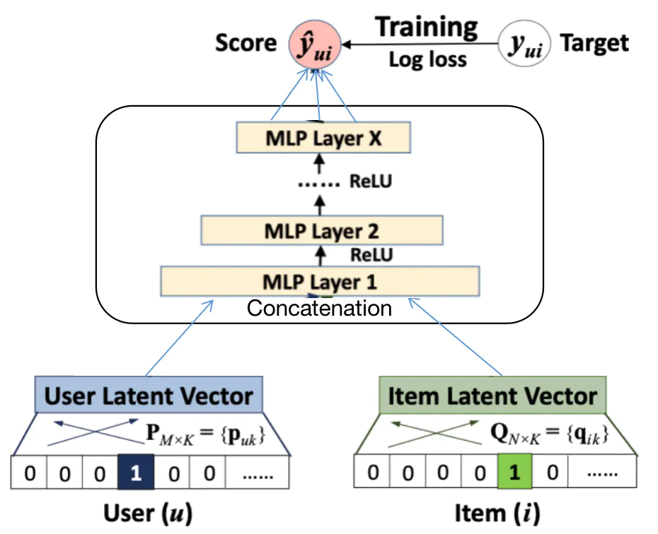
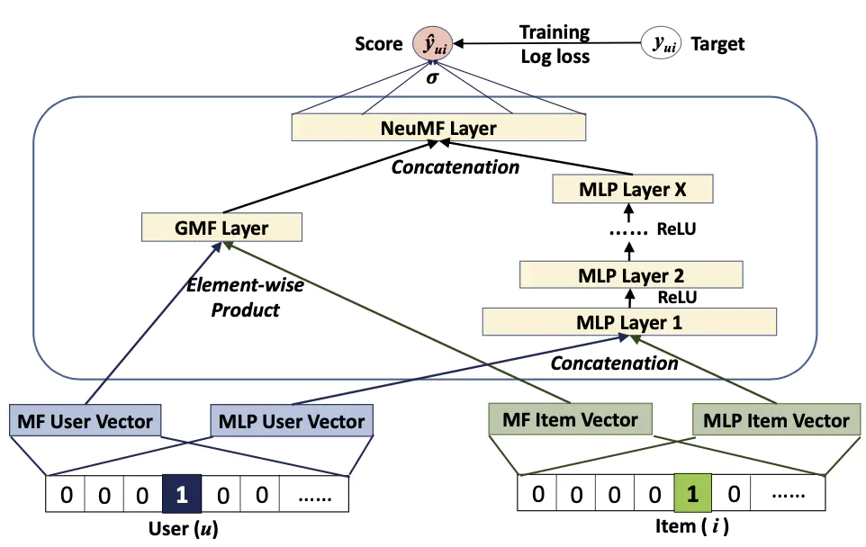

## 深度学习推荐算法之 NCF

原论文《**Neural  network-based Collaborative Filtering**》

### 1. 论文背景

​		尽管传统的矩阵分解算法 MF 算法利用潜在因子建模，可以提高模型的效果，并且还推广到了因子分解机模型，以实现特征交叉。但是无论是传统的矩阵分解算法，还是因子分解机，都只使用简单的交互函数（內积），內积操作只能将潜在特征进行线性组合，不足以捕获用户、商品交互数据中的复杂结构。于是，从这个问题出发，作者利用神经网络强大的建模能力和模拟任何函数的潜力，将深度学习与协同过滤结合起来。提出了 NCF。

​		论文先是提出了 NCF 的通用架构，然后再分别给出了两个基于此通用架构的两个实例 GMF 、 MLP，以及两者的混合模型 NeuMF。

### 2. 模型介绍

#### 2.1 NCF 的通用架构

​		论文提出了一个通用的 NCF 框架，重点阐述了如何使用一个强调隐式反馈数据二值性的概率模型来学习 NCF 模型参数，其框架如下：

​		最下面是输入层，分别包含了两个特征向量和，它们分别用来描述用户和物品。输入仅由一个用户向量和一个物品向量构成，它们分别是以 one-hot 编码的二值化稀疏向量。输入层上面的是 Embedding 层，它是一个全连接层，用于将输入层的稀疏表示映射成一个稠密向量。它所获得的用户(物品)稠密向量可以看做就是 MF 算法中用来描述用户(物品)的潜在特征向量。接着用户和物品的 embedding 向量被送入多层神经网络架结构中，这一层叫做神经协同过滤层(Neural CF Layer)，它用于将潜在特征向量映射成预测分数 (Score)。神经协同过滤层中的每一层可以被认为是用来发掘用户-物品交互中的某些隐含结构。神经协同过滤层的输出层(Layer X)的维度决定了模型的能力。最终的输出是预测分数，我们可以通过最小化和目标值之间的均方误差来训练模型。

​		NCF 预测模型如下：
$$
\hat y_{ui}=f(P^Tv^U_u,Q^Tv^I_i|P,Q,\Theta_f)
$$
​		其中 $P\in R^{M\times K}$，$Q\in R^{N\times K}$，$P^Tv^U_u,Q^Tv^I_i$ 分别表示用户向量 $v^U_u$ 和 物品向量 $v^I_i$ 经过Embedding层之后得到的特征向量， $M,\ N,\ K$ 分别代表用户数，商品数以及 Embedding 向量的维度，$\Theta_f$ 代表的是交互函数 $f$ 的参数。$f$ 在上图中被定义为多层神经网络，所以可以具有以下的表达形式：
$$
f(P^Tv^U_u,Q^Tv^I_i|P,Q,\Theta_f)=\phi_{out}(\phi_{X}(...\phi_{2}(\phi_{1}(P^Tv^U_u,Q^Tv^I_i))))
$$
​		其中 $\phi_x$ 代表的是神经协同过滤层中的第 $x$ 层的映射函数，$\phi_{out}$ 代表的是输出层的映射函数。

​		因为文中考虑的是模型对于隐式反馈数据的预测能力，而隐式反馈数据具有二值性 0 或 1。目标值是二进制0或者1，代表是否与有交互。因此，针对隐反馈数据的二值性这一属性，论文提出了从概率的角度来学习 NCF。
 		我们可以把当做一个标签，1 代表物品与用户有关，0 代表无关。预测目标可以认为是代表这物品有多大可能性与用户有关。为了赋予 NCF这样一个概率解释，我们需要限制的输出在 [0,1] 之间，为了达到这个目的，我们可以使用 sigmoid 函数作为输出层的激活函数。
 有了以上设定，我们可以定义似然函数如下：

​		对似然函数取负对数得到：

​		这就是 NCF 模型需要最小化的目标函数，可以使用 SGD 算法来进行训练优化。通过在 NCF 上进行概率处理，我们把隐反馈数据的推荐问题转变成了一个二值分类问题。

#### 2.2 广义矩阵分解 GMF

​		广义矩阵分解 GMF 是上述的通用 NCF 模型的一个实例，通过一定的限制，GMF模型会退化成基础的 MF 模型，也就是说传统的矩阵分解模型可以囊括在通用的 NCF 架构之下，下面是 GMF 模型的架构：

​		可以看到，其相当于将通用的 NCF 模型架构的 Neural CF Layers 实例化为一个 GMF Layer，其作用是对用户和物品的隐向量做按元素积的操作，然后再通过一个全连接层。

​		我们令用户代表，即用户的潜在特征向量；令代表，即物品的潜在特征向量。我们可以定义神经协同过滤层第一层的映射函数为：
$$
\phi_1(p_u,q_i)=p_{u\bigodot} q_i
$$

 其中⊙代表的是向量的逐元素相乘。然后将此向量映射到输出层：
$$
\hat y_{ui}=a_{out}(h^T(p_{u\bigodot}q_i))
$$
 其中代表的是激活函数，代表的是输出层的权重。如果我们把看成是恒等函数，令是全为1的单位向量，那么这就变成了MF 模型。

#### 2.3 多层感知机 MLP

​		多层感知机 MLP 可以看作是 NCF 架构下的另一个实例，其主要思路是将用户和物品隐向量拼接起来之后，再通过多个全连接层。这种将两个不同模型得到的向量拼接起来再通过某些网络层的操作，是多模态深度学习中广泛采用的方式。其模型架构如下：

​		其计算过程可以被精确地定义为：
$$
z_1=\phi_1(p_u,q_i)=\begin{bmatrix}p_u \\ q_i\end{bmatrix}\\
\phi_2(z_1)=a_2(W_2^Tz_1+b_2),\\......\\\phi_L(z_{L-1})=a_L(W^Tz_{L-1}+b_L)\\\hat y_{ui}=\sigma(h^T\phi_L(z_{L-1}))
$$
​		其中，和代表第层感知器的权重矩阵，偏置矩阵以及激活函数。对于感知器层的激活函数，我们可以在Sigmoid、tanh 以及 ReLu 中选择，实验证明，ReLU 激活函数是一个较好的选择，因为它更具有生物合理性，并且被证明不会导致过饱和。

#### 2.4 模型的融合 NeuMF

​		在前面介绍的两个 NCF 模型实例中，GMF 应用了线性内核来模拟潜在的特征交叉，MLP 使用了非线性内核从数据中学习潜在特征，那么自然而然地可以想到，我们可以将这两个模型融合。下面就是融合后的模型架构：

​		也即是说我们将两个模型在最终计算得分之前，先将中间向量进行拼接，然后再将拼接之后的向量送入一个全连接成计算得到最终的结果，那么上图计算过程的精确定义为：
$$
\phi^{GMF}=p_{u\bigodot}^{G}q^G_i\\\phi^{MLP}=a_L(W^T_L(a_{L-1}(...a_2(W^T_2\begin{bmatrix}p_u^M\\q_i^M\end{bmatrix}+b_2)...))+b_L)\\\hat y_{ui}=\sigma(h^T\begin{bmatrix}\phi^{GMF}\\\phi^{MLP}\end{bmatrix})
$$
​		其中和分别代表 GMF 和 MLP 模型的用户 embeding 向量；同理，和分别代表 GMF 和 MLP 模型的物品 embeding 向量。为了使融合模型具有更加强大的灵活性，GMF 模型和 MLP 模型分别独立学习 Embedding 。正如上面讨论的，这个模型结合了GMF的线性度和MLP的非线性度来对用户-物品之间的潜在结构进行建模。

​		由于 NeuMF 目标函数的非凸性，使得基于梯度的优化方法只能找到局部最优解。论文建议使用 GMF 和 MLP 的预训练模型来初始化 NeuMF。首先训练随机初始化的 GMF 和 MLP 直到模型收敛。然后，我们用它们的模型参数初始化 NeuMF 相应部分的参数。唯一的调整是在输出层，在那里我们将两者用权重连接起来：
$$
h=\begin{bmatrix}\alpha h^{GMF}\\(1-\alpha)h^{MLP}\end{bmatrix}
$$

这里的和分别代表 GMF 和 MLP 模型预训练的向量，是一个超参数，用来权衡两个预训练模型的权重。

### 3. 实验或工程技巧

​		回顾一下模型提出的背景和所要解决的问题，模型是希望将深度学习与协同过滤结合起来，协同过滤是希望通过用户的历史行为信息，预测用户接下来的行为。论文采用了 leave-one-out方法评估，即：对于每个用户，将其最近的一次交互作为测试集（数据集一般都有时间戳），并利用余下的交互作为训练集。由于在评估过程中为每个用户排列所有item花费的时间太多，所以遵循一般的策略，随机抽取100个不与用户进行交互的item，将测试item排列在这100个item中。
 		排名列表的性能由命中率（HR）和归一化折扣累积增益（NDCG）来衡量。同时，论文将这两个指标的排名列表截断为10。如此一来，HR直观地衡量测试项目是否存在于前10名列表中，而NDCG通过将较高分数指定为顶级排名来计算命中的位置。

### 4. 总结

​		NeuralCF 模型实际上提出了一个模型框架，它基于用户向量和物品向量这两个Embedding层，利用不同的互操作层进行特征的交叉组合，并且可以灵活地进行不同互操作层的拼接。从这里可以看出深度学习构建推荐模型的优势——利用神经网络理论上能够拟合任意函数的能力，灵活地组合不同的特征，按需增加或减少模型的复杂度。

​		NerualCF模型也存在一定的局限性，由于基于协同过滤的思想进行模型的构造，所以NeuralCF模型并没有引入其他更多类型的特征，这实际上在应用中无疑浪费了其他有价值的信息。此外，对于模型中互操作种类并没有进一步地探究和说明这都需要后面的深度学习模型能够进行深入地探索。

